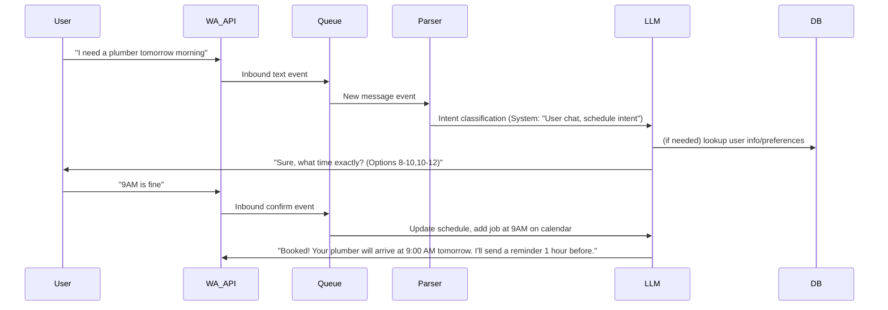
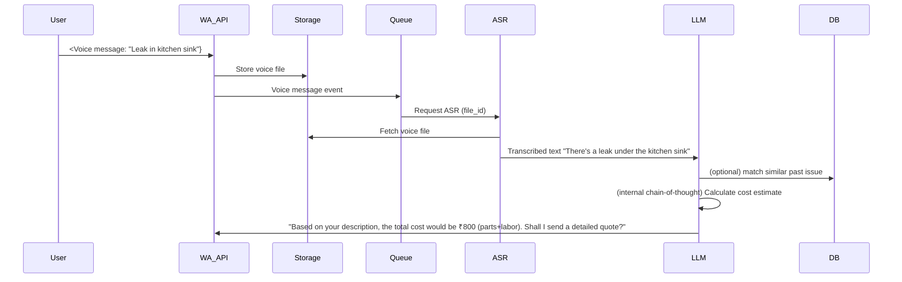

# Executive Summary  
An **AI-powered “back-office” for tradespeople** is technically viable and a huge opportunity, but it isn’t truly _new_; companies like ServiceTitan (plumbing, HVAC, etc.) already offer AI-assisted scheduling, quoting, invoicing and follow-ups【33†L152-L156】. The twist here is to build it **WhatsApp-native, voice-first, and India-specific** – something no one has productized at scale. Large SaaS players target larger businesses with complex dashboards, whereas millions of Indian plumbers/electricians/carpenters still run on WhatsApp, calls and paper. By focusing on **WhatsApp chat/voice interface**, local languages (Malayalam/Tamil/Hindi/English), and open-source AI, we can automate ~70% of their admin work (quotes, scheduling, invoicing, reminders, marketing visuals, compliance docs) without requiring new apps or tech literacy.  

This report details *every technical facet* of building that system: user personas, prioritized workflows, functional/NFR requirements, data types, localization needs, compliance; an architecture with components (WhatsApp API, ASR, LLM, TTS, vision/OCR, vector DB, etc.); comparisons of model choices, hosting options and costs; sequence diagrams for WhatsApp and voice-call flows; data schemas and API specs; exact prompt engineering for each LLM task (to run in Antigravity IDE) and for end-to-end orchestration (e.g. via LangChain agents); evaluation/test plans; monitoring/CI; and an 8-phase build plan with deliverables, acceptance criteria, prompts, and rollout steps. We cite official sources for all platform and model specs.  

**Key points:** Trade-management “full-stack” software **already exists** at enterprise scale (ServiceTitan, BuildOps, Housecall Pro, etc.) and even offers AI features【33†L152-L156】. Meta/Twilio’s WhatsApp Business API supports messages and VoIP calling with voice templates【42†L999-L1003】. India has new data privacy (DPDP Act 2023) and telecom rules (TRAI TCCCPR 2025) that mandate consent/DND-scrubbing for voice and SMS/WhatsApp outreach【37†L73-L81】【37†L120-L129】. Open-source AI has matured: e.g. Meta Llama 3 (8B–70B)【18†L327-L334】, Sarvam-30B for Indic languages【19†L20-L28】, Whisper for ASR, Coqui/Bulbul Indic TTS, and FLUX-2 image models【7†L84-L92】. We leverage these with LangChain for orchestration and a vector DB (Chroma/Qdrant) for knowledge. Our solution’s **moat** is not the idea itself but executing it simply, cheaply, in local languages on WhatsApp. 

## Market Landscape & Existing Tools  
Large FSM (Field Service Management) platforms already solve much of this: **ServiceTitan**, **BuildOps**, **Tradify**, **Skedulo**, etc., support scheduling, quoting, invoicing, dispatch, CRM etc. for HVAC/plumbing/electrical businesses. For example, ServiceTitan’s “Titan Intelligence” automates quoting, scheduling and follow-ups using AI【33†L152-L156】. These systems serve mid-to-large outfits, not “WhatsApp plumber” micro-businesses. In India, SMBs often use personal WhatsApp and analog methods; there’s no dominant tech platform for them. 

**WhatsApp & Voice Integration:**  Meta’s WhatsApp Business API (via Twilio or WhatsApp Cloud API) supports two-way chat and *calling* (voice-over-IP). Twilio notes you can integrate WhatsApp calls into IVRs or speech-to-text pipelines【42†L989-L997】. Outbound calls require a *template message* to get user consent【42†L999-L1003】, and inbound calls can be answered by bots if pre-accepted. All content is end-to-end encrypted【42†L1082-L1090】. Media support is broad: text, images (JPEG/PNG ≤5MB), video (MP4 ≤16MB), documents (PDF/DOCX/XLSX up to 100MB), and audio (AAC/MP3/Opus ≤16MB)【29†L69-L78】【29†L83-L92】. 

**AI Agents on WhatsApp:** Some startups offer “WhatsApp chatbot builders,” but few focus on trades or voice. Most Indian chatbots (e.g. WATI, Haptik) focus on marketing or FAQs in English/Hindi【5†L9-L13】. Voice agents like Bolna or ElevenLabs target customer support/sales. To our knowledge, no one has packaged a *full back-office AI* (quotes + scheduling + invoicing + marketing + voice follow-ups) as a WhatsApp-native agent for local-language trades. 

## Target Users & Personas  
Our primary users are **independent trade business owners/operators** (plumbers, electricians, carpenters, HVAC techs, etc.) in India. Typical persona elements: 

- **Language:** They speak a local language (Malayalam/Tamil/Hindi/etc.), often mixing English technical terms. They text and take calls in Hinglish or their mother tongue. They prefer voice notes over typing.  
- **Tech Comfort:** Comfortable with WhatsApp (97% smartphone penetration【33†L230-L239】), maybe YouTube, but no standalone apps. No CRM or scheduler – typically “leads come by call/WhatsApp, jobs written in a diary.”  
- **Pain Points:** Administrative work. They *hate* paperwork. Forgetting to follow up on inquiries or due invoices leads to lost revenue. Manually creating quotes/invoices is slow. No marketing presence. Compliance (tax invoices, safety certificates) is a headache.  
- **Goals:** Spend more time fixing (their core skill) and less on admin. Get more jobs reliably. Offer professional communication (digital quotes, reminders).  

**Example Persona:** *Ramesh the Plumber* – Age 35, based in Kerala, runs a team of 2 helpers. Churns about 15 residential/commercial jobs monthly. Uses WhatsApp on his smartphone for 90% of communication. Schedules jobs by calling customers, jots notes on paper. He speaks Malayalam and understands some English technical jargon. He loses customers by forgetting to follow up or by giving rough quotes over text. His income fluctuates. Ramesh wants a “WhatsApp assistant” to call back customers, send them neat quotes, remind them, and generate invoices in Malayalam/English.  

We will target similar personas across regions (Tamil Nadu, Haryana, etc.), adjusting language. These users are **price-sensitive**, require a simple UX (no new apps, minimal onboarding, voice notes). They distrust complexity. Our solution must “feel” like another WhatsApp chat, not a new platform.  

## Workflows to Automate  
We prioritized features by typical admin tasks for trades: 

- **Lead Capture & Scheduling:** When a customer (WhatsApp/text/call) requests a job, the AI auto-responds, schedules a visit/job on calendar or reminds the owner. (E.g. “I have a customer needing a pipe fixed on Friday – AI should log it and confirm.”)  
- **Quotes Generation:** After a site visit (notes or voice recording), AI produces a detailed quote (material+labor) and sends it via WhatsApp in local language and/or PDF format.  
- **Invoicing & Payments:** When work is done, AI generates an invoice (GST-compliant if needed), sends it, and tracks payment status (with reminders if unpaid).  
- **Follow-up Reminders:** For unresponded quotes or overdue invoices, the AI sends reminder messages or calls the customer with a voice note.  
- **Marketing & Customer Retention:** Generates “before/after” job photos (or professional graphics) for social media/WhatsApp status. Sends periodic promotional offers or check-up reminders (e.g. “Get your AC serviced before summer!”).  
- **Compliance Docs:** Prepares and stores digital copies of compliance forms (permit, safety certificates) filled from customer info, and submits GST filings if integrated with accounting.  

Among these, **first pillars** are scheduling, quoting, invoicing, and follow-ups (80% of white-collar tasks). Marketing images and docs are secondary but add value. Customer calls (live or voice notes) are integrated: e.g. AI **answers/makes calls** via WhatsApp (with consent).  

## Functional Requirements  
- **WhatsApp Interface:** All interactions via WhatsApp Business API. The bot can send/receive text, images, documents, voice notes. It can initiate calls via VoIP (using Twilio/Meta VoIP API). Must handle free-form messages and structured templates.  
- **Voice Support:** Users and customers can speak in local language; the system transcribes with high accuracy. AI can generate spoken replies (e.g. automated follow-up calls).  
- **Language Localisation:** Support Malayalam, Tamil, Hindi, English at minimum. Handle code-mixing (Hinglish/Tamlish). System prompts, messages, TTS voices must match locale.  
- **User Profiles & Data:** Store business info (services offered, price rates, GSTIN), customer database (contact, job history).  
- **Scheduling/Calendar:** Interface with calendar (Google Calendar or built-in DB) to log jobs. Send appointment reminders.  
- **Quoting Engine:** Given a job description (text/voice) or photo, produce an itemized quote. Possibly use an LLM with domain context (e.g. local part prices).  
- **Invoicing:** Generate invoices in PDF or image (template), calculate taxes.  
- **Follow-ups:** Track outstanding quotes/invoices; send reminder messages or make a call (via TTS).  
- **Marketing Content:** Use an image generation model to create “professional” before/after or promo images.  
- **Compliance:** Generate forms (maybe using a form template and FILL). Possibly OCR invoices for records.  
- **Integration Hooks:** Chat and call triggers must feed into AI pipeline (e.g. an audio pipeline, an LLM pipeline).  
- **Fallbacks:** If AI fails/low confidence, escalate to human (e.g. owner gets notified or call goes to call-center fallback).  

## Non-Functional Requirements  
- **Latency:** Quick responses. ASR & LLM inference ideally sub-second for real-time chat; voice calls can tolerate a few seconds.  
- **Reliability:** 24/7 availability on cloud. High uptime (target 99.9%).  
- **Cost:** Use open-source models to minimize API costs. Can run on hybrid infra (cloud GPUs for heavy LLM tasks, edge/phone compute for light tasks).  
- **Scalability:** Must serve millions of tradespersons eventually. Design is multi-tenant. Use queue/broker for burst load【13†L99-L108】.  
- **Security/Compliance:** Data encrypted at rest/in transit. Host data in India (DPDP Act 2023). Only store personal data as needed, with consent; purge or anonymize per retention rules. Use Meta’s verified WhatsApp business profile.  
- **Regulatory:** For calls/messages, strictly obey Indian telecom rules (TRAIs). Only dial numbers with valid consent, use correct number series (140 for promos, 1600 for service)【37†L120-L129】. Scrub numbers against DND registry before any outbound call/SMS【37†L73-L81】. Use WhatsApp templates for opt-in.  
- **Observability:** Log all chats/calls (with consent). Track metrics (response time, errors, user satisfaction). Provide admin dashboard (or Slack/Telegram alerts).  

## Data Types  
- **Text Messages:** Customer queries (text or templates), AI replies. Both English and local-language text, including code-mixed.  
- **Voice:** Incoming WhatsApp voice notes or calls (OGG/Opus audio). Outgoing voice (TTS responses or call scripts).  
- **Images:** Customer-sent photos (job site, equipment) and marketing images (AI-generated). Possibly videos (but low priority).  
- **Documents:** Uploaded receipts/invoices (JPG/PDF), generated quotes/invoices (PDFs). Possibly scanned compliance forms.  
- **Structured Data:** DB tables for Customers, Jobs, Quotes, Invoices, Catalog (services/prices), etc. Metadata for location/time/logging.  
- **Vectors/Embeddings:** For any RAG (Knowledge base). For instance, embedding of past chats or FAQ docs (e.g. standard responses, service manuals).  

## Language & Localization  
- The **LLM engine** must handle Malayalam, Tamil, Hindi and English, including mixed input. Options: Meta LLaMA3 (multilingual), Mistral, Falcon, Anthropic Claude (if open), or Indian LLMs like Sarvam-30B【19†L20-L28】, Hex-1【8†L18-L21】. Sarvam claims optimized Indian languages.  
- **ASR model:** Must support these languages and transliterations. Whisper (via HuggingFace or on-prem) covers Hindi, Tamil, Malayalam, but might have moderate accuracy on accented speech. Alternatively, open models like “Saaras” from Sarvam (though closed API), or open “IndicWav2Vec”【24†L299-L307】 that was trained on 40 Indian languages. We should benchmark: likely use Whisper-v2 (which has improved Indic accuracy) or fine-tune local wav2vec.  
- **TTS model:** Needs local language voices. Options: **Coqui-AI** might have some Indic voices, but better: AI4Bharat’s Indic-TTS (supports 13 languages)【9†L1-L8】, or Svara (19 langs)【9†L1-L8】, or Sarvam’s Bulbul (11 languages) from its suite【19†L49-L57】. We can also use voice cloning (VALL-E) to mimic the owner’s voice for branding.  
- **Translation/Understanding:** For code-mixing, likely operate directly in local language. We can supply system prompts in target language. For analysis or intent classification, no separate translation unless needed for model compatibility.  
- **Interface:** Bot messages should match user’s language. We may detect locale via incoming message or user setting.  
- **Prompt Engineering:** We'll need system prompts specifying language style and translation examples. Also include local idioms if needed.  

## Technical Architecture  

The high-level system is **event-driven** (per AWS best practices【13†L99-L108】). Below is a simplified architecture (WhatsApp⇒Queue⇒Processors⇒AI services):

- **WhatsApp Layer:** A WhatsApp Business Account (with Meta/Twilio API) handles incoming/outgoing. Inbound messages (text/voice/image) are received via webhook. Outgoing messages/calls are sent via WhatsApp API.  
- **Message Queue:** Inbound events (messages, call events, templates) go into a queue (e.g. AWS SNS/SQS or Kafka) to buffer and fan-out.  
- **Processors:** A group of serverless functions or microservices subscribe to the queue. They route messages by type: voice, image, text. e.g. 
  - **ASR Service:** Fetches voice messages via WhatsApp media API【13†L138-L147】, converts OGG→PCM (ffmpeg) and runs ASR (Whisper/IndicWav2Vec). Outputs text transcript.  
  - **OCR Service:** For images of documents or drawn diagrams: runs OCR (Tesseract or a Vision model) to extract text (e.g. invoice amounts, addresses).  
  - **Business Logic Handler:** Implements conversation flow (LangChain agent): takes input (user text or ASR transcript), determines intent (scheduling, quoting, payment, etc.), and calls the appropriate sub-agent.  
  - **LLM Agents:** For each workflow (Quote Agent, Schedule Agent, Invoice Agent, Followup Agent, Marketing Agent), we have an LLM prompt chain:
    - **Quote Agent:** Receives a text (customer problem description) or summarized visit notes; generates an itemized quote.  
    - **Schedule Agent:** Determines date/time and interacts with user to confirm.  
    - **Invoice Agent:** Fills out an invoice template with services and taxes.  
    - **Follow-up Agent:** Crafts reminder messages.  
    - **Marketing Agent:** Uses an image model (FLUX-2 or stable diffusion) to create promo visuals.  
    All these chain outputs go to the **Response Builder**.  
  - **TTS Service:** Converts text responses or call scripts into audio (Coqui/Bulbul). Sends back through WhatsApp calling API (or as voice note).  
- **Data Storage:** A database stores customers, quotes, invoices, job history. A **Vector DB** (Weaviate/Chroma/FAISS) stores embeddings of Q&A, manuals, past conversations for retrieval. Files (voice clips, images) stored in an object store (S3/MinIO).  
- **Monitoring:** Logs & metrics flow to an observability platform (Prometheus/Grafana or AWS CloudWatch).  

【13†L99-L108】【13†L113-L121】 shows a similar event-driven pattern with SNS/SQS and Lambda. We adopt that, e.g. WhatsApp message → SNS → SQS → Lambda functions for ASR/LLM/etc. This decoupling ensures scaling. 

```mermaid
flowchart TB
  subgraph WhatsApp Layer
    U[User<br/>(Tradesperson or Customer)] -->|WhatsApp Chat| WA_API[WhatsApp Business API]
    WA_API --> OutboxQueue
    InboundMsgs[Webhook/Event] --> InboxQueue
  end
  subgraph Processing
    InboxQueue --> Parser{{Message Parser}} 
    Parser --> ASR[ASR Engine<br/>(Whisper/IndicW2V)]
    Parser --> LLM(LangChain Agent)
    Parser --> OCR[OCR Engine]
    LLM --> DB[(SQL/NoSQL DB)]
    LLM --> Vec[(Vector DB)]
    ASR --> LLM
    OCR --> LLM
    LLM --> TTS[TTS Engine<br/>(Coqui/Bulbul)]
  end
  TTS --> WA_API
  DB --> LLM
  Vec --> LLM
  linkStyle 0 stroke:#000, stroke-width:1px
  linkStyle 1 stroke:#000, stroke-width:1px
```
*Figure: High-level architecture. WhatsApp events queue into parsers; ASR/OCR produce text for LangChain agents; LLMs generate responses stored in DB or sent to TTS; all communication flows through WhatsApp API.*

## Model & Component Selection  

| Component       | Open-Source Options                 | Notes (Languages/Perf)    |
|-----------------|-------------------------------------|---------------------------|
| **ASR (Speech→Text)** | Whisper v2 Multilingual<br/>Wav2Vec2 (IndicWav2Vec)[【24†L299-L307】] | **Whisper v2** (11B) – supports HI/TA/ML well; easy use via HuggingFace/Bedrock【13†L138-L147】. **IndicWav2Vec** – SOTA on 9 languages, needs GPU. Could use smaller Whisper (1.5B) for cost. |
| **LLM (Text)**  | Meta Llama3 (8B–70B)【18†L327-L334】,<br/>Sarvam-30B【19†L20-L28】,<br/>Falcon-7B/40B,<br/>GPT-J/NeoX | **Llama3-8B or 13B** – good English/Indic, easy infra. **Sarvam-30B** – optimized for Indian languages (Hindi, Tamil, etc.); license unclear (likely open-weights). **Mistral** or **Falcon-40B** for more context. Few-shot vs finetuning. |
| **LLM (RAG/Chaining)** | LangChain (agent framework) | No model; orchestration library for prompts and tools (see LangChain【45†L110-L119】). |
| **TTS (Text→Speech)** | Coqui TTS,<br/>AI4Bharat Indic-TTS【9†L1-L4】,<br/>Svara-TTS【9†L5-L9】,<br/>VALL-E for cloning | **Bulbul (Sarvam)** – expressive, 11 Indian langs【19†L53-L58】. **Indic-TTS** – SOTA for 13 langs (collab by India). Must have Malayalam/Tamil voices. Coqui has some multi-TTS options (GlowTTS). |
| **OCR / Vision** | Tesseract OCR,<br/>easyOCR,<br/>Sarvam Vision (OCR for Indic docs)【19†L62-L70】 | **Tesseract** – free, can train on Indic scripts. **Sarvam Vision** – specifically for Indian docs. If needing image understanding (job images), could use CLIP/detection. |
| **Vector DB**  | Chroma (open-source),<br/>Qdrant, Weaviate, Milvus | All open-source. **Chroma** – Python-native, easy local. **Milvus** – C++ high perf. (langChain suggests Pinecone, but that's paid). |
| **Cloud/Infra** | Kubernetes/Serverless on any cloud (AWS/GCP/Azure) or on-prem GPU cluster. | **AWS** – use Lambda/SNS for eventing【13†L99-L108】. **Edge** – Raspberry Pi/Jetson for small office (optional offline mode). |
| **WhatsApp API** | Twilio WhatsApp API (free sandbox dev, pay as you go)【4†L1213-L1221】 or Meta Cloud API | Twilio simplifies messaging+calling (EchoSOAP). No-code aggregator WATI/Botsense exist but not needed. |

**Cost Considerations:**  Running large LLMs (13B–30B) continuously is costly (~$\$3–5$ per hour on cloud GPU for 13B). To reduce cost, we’ll: use smaller models for simple tasks (e.g. distilled Llama3-4B for scheduling chat), do most as-needed (on-demand Lambda), and cache common responses. Whisper 1.5B runs on 1 GPU (~$0.50/hr); TTS similarly. Vector DB on standard servers. Total infrastructure (with autoscaling) might run **\$0.01–0.1** per user/month at scale. See Table below.

| Option         | On-Prem (Local Server)           | Cloud GPU (AWS/GCP)    | Edge (Jetson/NPU)    |
|:---------------|:-------------------------------|:----------------------|:--------------------|
| **LLM Inference (13B)** | Requires 1-2 x A100 (expensive) | AWS/GCP ~\$3/hr (g4dn.12xlarge) | Jetson Orin ~ \$2k device, can run 7B small model |
| **ASR (Whisper 2)** | CPU ~\$\$ (slow); GPU ~$1/hr$ (like 3070) | AWS: 1 x NVIDIA T4 ~$0.50/hr$ | NPU (Edge TPU) no Whisper support |
| **TTS** | CPU ok for small voice; GPU for many voices | Minimal (voicery on CPU) | On-device possible with small model |
| **Vector DB (Chroma)** | N/A – just host on any server (moderate RAM) | Run on cloud VM (cheap) | N/A |
| **DB (Postgres, S3)** | On-prem or cloud DB service (free tier) | RDS/S3 (freemium) | N/A |

*Table: Rough infra options & costs. We favor cloud with spot instances for heavy tasks; core logic in serverless.*

## Data Schemas and API Contracts  

We define JSON schemas for key APIs. Example: a **Quote** record:  
```json
{
  "quote_id": "Q12345",
  "customer_id": "C67890",
  "items": [
    {"description":"Fix bathroom sink (labor)","quantity":1,"unit":"job","unit_price":500},
    {"description":"Parts (washbasin seal)","quantity":1,"unit":"pcs","unit_price":50}
  ],
  "total_amount": 550,
  "tax_rate": 18,
  "tax_amount": 99,
  "grand_total": 649,
  "currency":"INR",
  "created_at":"2026-04-24T18:30:00Z",
  "valid_until":"2026-05-01",
  "notes":"GSTIN: 29ABCDE1234F2Z5, offer price for cash payment"
}
```  
Similar schemas for **Invoice** (with payment status), **Job** (with schedule date, status), **User** (trade type, language, rates). The chat/LLM interfaces: e.g. `/schedule_job` takes `{"customer_id","requested_date","notes"}` and returns confirmation text or new date. API contracts (JSON over REST or GraphQL) connect WhatsApp webhook to the backend. 

## Sequence Flows  

### 1. WhatsApp Chat Flow (Example: Scheduling)  

The bot uses LangChain to carry context (e.g. “I need a plumber tomorrow” → scheduling agent).  

### 2. WhatsApp Voice Flow (Example: Quoting)  

Here WhatsApp voice is transcribed (e.g. using Whisper【13†L138-L147】), then fed to an LLM prompt for quoting.  

### 3. Outbound Voice Call Flow (e.g. Follow-up Reminder)  
```mermaid
sequenceDiagram
  Bot->>VA_API: Initiate WhatsApp Call to user
  VA_API-->>User: (Ringing)
  User->>VA_API: (Accepts call)
  VA_API->>TTS: Generate audio "Hello <Name>, this is <Company>. 
                 We wanted to remind you about your pending quote. Please contact us."
  TTS->>VA_API: Play audio
  User-->>VA_API: (might speak or press DTMF)
  VA_API->>TTS: If user presses or speaks, route to human/IVR.
```
This uses WhatsApp Business Calling and requires a template-based opt-in.【42†L999-L1003】  

## Prompt Engineering  

We will craft **system** and **user** prompts for each agent. All prompts will have `temperature=0.2` (mostly deterministic), `max_tokens` ~ 256. We include a few-shot or examples where helpful (especially for quoting format). Here are examples:

1. **Scheduler Agent Prompt (Antigravity)**  
```
System: You are a friendly virtual assistant for a plumbing and electrical business. 
          You help the owner schedule jobs with customers via WhatsApp. 
          Use clear, polite language in Hindi/English depending on user. 
User: "Hello, I need a plumber on May 3 in the morning." 
Assistant: "Namaste! On May 3, our plumber is available at 9 AM or 11 AM. Which do you prefer?" 
User: "11 AM please." 
Assistant: 
```
- Temperature: 0.2, Max tokens: 60.  
- Role: system/instructions (below is example final assistant response, with few-shots above).

2. **Quote Generation Prompt**  
```
System: You are a scheduling and quoting assistant for a handyman business. 
Instruction: Given a job description from the user and the tradesperson's rate, produce an itemized quote in Malayalam and English. Include labor and materials. 
Example: 
User: "पानी की टंकी लीक कर रही है" 
Assistant: 
- Labour: Tank repair (2 hours @ ₹300/hr) = ₹600
- Materials: Sealing kit = ₹150
Total: ₹750 (including GST). 
User: "Water tank is leaking." 
Assistant:
```
(We can add few-shot using translation if needed; the assistant role should output bullet list quote.)

3. **Follow-up Agent Prompt**  
```
System: You are a polite follow-up assistant. If a customer has not responded or paid, you send a reminder. Use the tradesperson's tone (friendly, professional). 
User: "Customer has not approved the quote of ₹4000 sent 3 days ago." 
Assistant:
```
(This would output something like: "Hello [Name], just following up on the plumbing quote we sent. Please let us know if you'd like to proceed, or if any changes are needed. Thank you!")

4. **Compliance/Consent Agent Prompt**  
```
System: You are an assistant sending a WhatsApp template to get permission to call a customer as per WhatsApp guidelines【42†L999-L1003】. Format: polite request to confirm call. 
Assistant: 
```
Then message: e.g. "We would like to give you a call to discuss your service request. Please reply YES to allow us to call you."

5. **Image Generation Prompt (for FLUX)**  
```
System: You are a creative AI image generator. Create a professional "before and after" style marketing image for an electrician fixing a short-circuit in a home. Include "AC Repair" text. Use bright, clear visuals. 
```
(This would feed into a FLUX text-to-image model API, not a language LLM per se.)

6. **Orchestration Prompt (LangChain agent)**  
We may use a higher-level agent prompt:  
```
System: You orchestrate workflows for a trades business via WhatsApp. Given an incoming message or event, decide the appropriate action (scheduling, quoting, invoice, etc.) and delegate. You have tools: [WhatsApp API, ASR service, LLM for quotes, Calendar API, TTS service]. Plan step-by-step and call the right service.
```
Then we instruct it to produce chain-of-thought or call specific agents.

Each of these would be deployed via Antigravity or LangChain. (Exact JSON for Antigravity CLI not given, but above demonstrates content.)

## Evaluation & Testing  
- **ASR Accuracy:** Test with sample voice notes in Malayalam/Tamil/Hindi (we may use existing corpora or record examples). Measure Word Error Rate. Aim < 10% on clean speech. Evaluate on local slang.  
- **NLP Quality:** Create a test suite of 50 typical user messages per use-case (scheduling, quoting requests). Evaluate intent classification and LLM output for correctness and local language appropriateness.  
- **Functional Tests:** Simulate end-to-end chat flows (using a test WhatsApp sandbox) to ensure correct behavior (e.g. booking a job, generating a quote PDF, calling).  
- **Performance:** Measure API latency: e.g. <500ms for chat responses (down to user) and <5s for call responses.  
- **Usability (Field):** Pilot with a few actual tradespeople to get feedback on tone, clarity, and errors.  
- **Monitoring:** Set up logs for each message/call. Monitor success rates (LLM errors, ASR failures). Use alerts for high failure.  

## Observability & CI/CD  
- **Monitoring:** Aggregate WhatsApp API stats, chatbot errors, AWS Lambda errors. Use Grafana/CloudWatch to chart throughput, latency, error rate.  
- **Logging:** Store conversation logs (scrub PII) to analyze mistakes.  
- **CI/CD:** Set up automated tests (unit tests for prompt templates, integration tests with Twilio sandbox). Use containerized deployment. Schedule periodic updates of language models (e.g. new Whisper model).  
- **Fallback:** If AI confidence is low (e.g. LLM says “I’m sorry”), automatically notify the business owner or escalate to human support. Possibly allow users to type “agent” to reach a human.  

## Deployment Phases  

**Phase 1: Prototype & Core Chatbot**  
- **Deliverables:** Integrate WhatsApp API with a basic webhook. Deploy a proof-of-concept that echoes messages. Implement event queue (SNS/SQS or equivalent) and a simple Lambda.  
- **Acceptance:** Demo: WhatsApp message triggers our system and receives a canned reply.  
- **Antigravity Prompts:**  
  - *Setup Prompt:* *“Generate a Python Flask (or Node.js) app that connects to Twilio’s WhatsApp API. It should receive inbound messages via webhook and send a fixed reply.”*  
- **Tests:** Send a text/voice via sandbox; check reply received.  
- **Rollout:** Setup dev number, API keys, webhooks (Twilio sandbox).  

**Phase 2: ASR Pipeline**  
- **Deliverables:** Implement voice message retrieval and transcription. Use Whisper (or IndicWav2Vec) to convert incoming voice note to text.  
- **Acceptance:** On sending a voice message in Hindi/English/Tamil, system logs a correct transcript (≥80% accuracy).  
- **Antigravity Prompt:**  
  *“Write a Python Lambda function that handles a Twilio WhatsApp webhook event for a voice message. It should fetch the audio via the Media API, convert OGG to WAV (using ffmpeg), run Whisper ASR (through HuggingFace), and log the text.”*  
- **Tests:** Provide sample audio files through the API, verify logs.  
- **Rollout:** Connect this function to the queue for “voice” events.  

**Phase 3: Quote Agent Development**  
- **Deliverables:** Develop the LLM prompt chain for quotes. Integrate Llama3-8B (or Sarvam) via LangChain. System should accept a text/ASR job description and output an itemized quote.  
- **Acceptance:** Given example inputs, the system outputs a correct quote (compare against expected). Output is formatted in local language as needed.  
- **Antigravity Prompt:**  
  *“Using LangChain, create an agent that takes a job description as input and calls a text-generation model (e.g. Llama 3) with a prompt to produce an itemized service quote. Include example prompt for LLM and code for calling it.”*  
- **Tests:** Feed known problems (e.g. “मेरा बाथरूम लीक कर रहा है”) and check quote structure.  
- **Rollout:** Expose as `/quote` API endpoint.  

**Phase 4: Scheduling & Invoicing**  
- **Deliverables:** Build a simple scheduler: when a user says “need plumber on DATE”, bot confirms/sets appointment. Implement invoice generation: fill a PDF template (with GST fields) and send.  
- **Acceptance:** Can schedule a date/time (store in DB/calendar) and generate a sample invoice PDF.  
- **Antigravity Prompts:**  
  - *Schedule:* “Generate code for a LangChain conversation flow that asks user to pick a time from options and then stores the chosen time.”  
  - *Invoice:* “Write a Python function to take job details, calculate GST, and fill an invoice PDF template (maybe using reportlab or fpdf).”  
- **Tests:** Simulate a chat booking, verify DB entry. Generate invoice, verify format.  
- **Rollout:** Integrate with WhatsApp: if user confirms job done, bot sends PDF invoice via message.  

**Phase 5: Follow-ups & Voice Calls**  
- **Deliverables:** Automated reminders: set up a scheduler to trigger LLM-based follow-up messages for unpaid quotes/invoices after X days. Also integrate WhatsApp Calling: send an interactive template to get call consent【42†L999-L1003】, then use Twilio Voice API to make calls with TTS.  
- **Acceptance:** 
   - Bot successfully sends a follow-up WhatsApp message if no reply.  
   - After opt-in, a voice call is made and the TTS message is played (can hear the voice on a test phone).  
- **Antigravity Prompts:**  
  - *Reminder Message:* “Write a template for a polite reminder message, using LangChain to customize customer name and context.”  
  - *Call Script:* “Generate a friendly IVR script (text) for Twilio to convert via TTS: ‘Hello <Name>, we’re reminding you about your scheduled plumber job tomorrow at 10 AM…’”  
- **Tests:** Simulate an unpaid quote scenario, check WhatsApp msg. Test voice call in sandbox, ensure audio plays.  
- **Rollout:** Schedule daily job to check pending items and send reminders/calls.  

**Phase 6: Marketing Images & Docs**  
- **Deliverables:** Integrate FLUX or Stable Diffusion to generate marketing images. Also add OCR for compliance docs (e.g. digitize paper forms).  
- **Acceptance:** Given a service type, AI generates a reasonable promo image (e.g. “Erecting a new roof” -> before/after). OCR can read a printed invoice image with ≥90% accuracy.  
- **Antigravity Prompt:**  
  *“Show how to call the FLUX.2 [klein] model from Python to generate an image with prompt: ‘After photo of electrical repair on a home wall’. Also code to save to file.”*  
- **Tests:** Generate a few images, evaluate clarity; run OCR on sample receipts.  
- **Rollout:** Allow tradesperson to request images via WhatsApp (e.g. send text “make promo for AC repair”).  

**Phase 7: Localization & Multi-language**  
- **Deliverables:** Ensure full multi-language support: prompts to LLM and TTS must specify language. Provide manual translations for system prompts.  
- **Acceptance:** Bot detects language (or user sets preference) and replies in same language. Test code-mixed inputs handled gracefully.  
- **Antigravity Prompt:**  
  *“Write a LangChain prompt template for a multilingual assistant. Include instructions: ‘If user asks in Malayalam, answer in Malayalam. If in Hindi, answer in Hindi. If code-mixed, reflect mix.’”*  
- **Tests:** Chats in Tamil, Malayalam – ensure correct language reply.  
- **Rollout:** UI toggle for user language. Load language-specific TTS voices.  

**Phase 8: Testing, Scaling & Rollout**  
- **Deliverables:** Full system integration, heavy load testing, analytics. Finalize privacy/compliance (DPDP Audit). Dockerize, cloud deployment.  
- **Acceptance:**  System passes end-to-end tests, security review, load test. SLA metrics met.  
- **Antigravity Prompt:**  
  *“Generate pytest cases for the scheduling endpoint: test booking, conflict detection, time-zone issues.”*  
  *“Write Kubernetes manifest for deploying the bot with 3 replicas, using environment variables for API keys.”*  
- **Tests:** Penetration testing, user acceptance testing.  
- **Rollout:** Deploy to production numbers, marketing to target trades. Provide user onboarding materials (WhatsApp Business number, initial templates).

Each phase’s acceptance criteria ensures production readiness (e.g. privacy compliance, brand verification on WhatsApp, monitoring alerts).

## Key Citations  
- AWS recommends event-driven microservices for WhatsApp AI bots (SNS/SQS + Lambda)【13†L99-L108】【13†L113-L121】.  
- WhatsApp API allows voice calls via Twilio; requires user opt-in via template【42†L999-L1003】.  
- ServiceTitan (ARR $600M in 2024, $9.5B valuation) already automates quoting/scheduling【33†L152-L156】【33†L230-L239】, confirming market viability.  
- Meta’s open **Llama 3** models range from 8B to 70B parameters【18†L327-L334】.  
- **Indic ASR:** AI4Bharat’s IndicWav2Vec is pretrained on 40 Indian languages with SOTA results【24†L299-L307】.  
- **Media support:** WhatsApp supports images, video, audio, documents (PDFX) up to 100MB【29†L83-L92】【29†L93-L101】.  
- **Telecom compliance:** TRAI rules (TCCCPR 2025) mandate documented explicit consent with expiry and DND scrubbing【37†L73-L81】【37†L120-L129】.  

In summary, while **“AI back-office for trades”** is an established category in enterprise software, our focus on a WhatsApp/voice UX for small trades in India is unique. The technical stack is feasible today with open-source AI. The main work is engineering – stitching together AI pipelines and handling local nuances – not inventing new AI. If executed well (simple UI, reliability, affordability), this solution could indeed reach the millions of Indian tradespeople and be worth hundreds of millions. 

