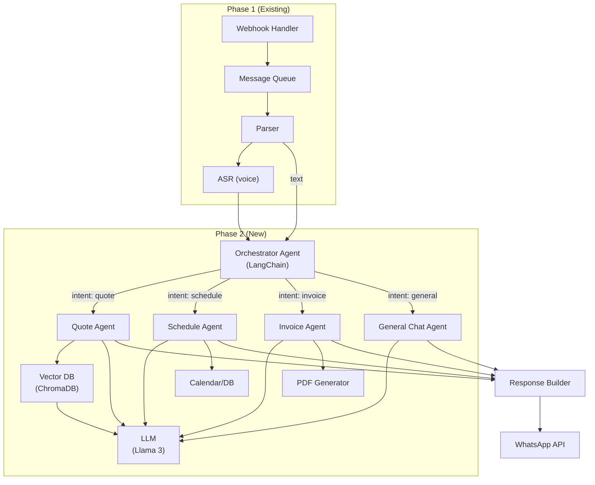
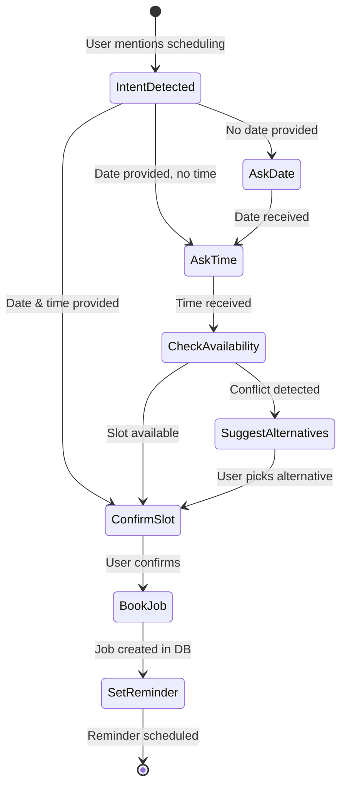

# Phase 2: AI Agents — Quoting, Scheduling & Invoicing

> **Scope:** LangChain Orchestration + Quote Agent + Schedule Agent + Invoice Generator  
> **Duration:** ~4–5 weeks  
> **Goal:** Build the intelligent core — LLM-powered agents that understand user intent, generate itemized quotes, manage job scheduling, and produce GST-compliant invoices, all integrated into the WhatsApp pipeline from Phase 1.  
> **Prerequisite:** Phase 1 complete (WhatsApp webhook, queue, ASR all operational)

---

## 2.1 Objectives

| # | Objective | Success Metric |
|---|-----------|---------------|
| 1 | LangChain orchestration agent routes intents correctly | ≥ 90% accuracy on 50 test messages across scheduling/quoting/invoicing/general |
| 2 | Quote Agent generates itemized quotes from text/voice | Correct format with labor + materials + GST; in local language |
| 3 | Schedule Agent books jobs with confirmation flow | User says "need plumber Friday 9 AM" → job record created in DB |
| 4 | Invoice Agent generates PDF invoices | GST-compliant PDF sent via WhatsApp after job completion |
| 5 | Vector DB stores business knowledge for RAG | Quotes and responses improve with context from past jobs |

---

## 2.2 Tech Stack Additions (Phase 2)

| Component | Choice | Rationale |
|-----------|--------|-----------|
| **LLM** | Meta Llama 3 8B (primary) / Sarvam-30B (Indic fallback) | Good multilingual, runs on single GPU, open-source |
| **LLM Serving** | vLLM or Ollama (local dev) / AWS Bedrock (prod) | Fast inference, easy deployment |
| **Orchestration** | LangChain (Python) with Tool-calling agents | Mature framework, tool integration, memory management |
| **Vector DB** | ChromaDB (local) / Qdrant (prod) | Lightweight, Python-native, LangChain-integrated |
| **PDF Generation** | ReportLab or FPDF2 | Python-native PDF creation for invoices/quotes |
| **Calendar** | Google Calendar API (optional) / internal DB scheduler | Job scheduling with reminders |

---

## 2.3 Architecture (Phase 2 Additions)



---

## 2.4 Detailed Deliverables

### 2.4.1 LangChain Orchestration Agent

The **Orchestrator** is the brain that sits between the message parser and the specialized agents. It:
1. Takes user input (text or ASR transcript)
2. Classifies intent
3. Routes to the correct agent
4. Manages conversation memory (multi-turn)
5. Handles fallbacks/errors

**Intent Categories:**
| Intent | Trigger Examples | Routes To |
|--------|-----------------|-----------|
| `schedule` | "I need a plumber tomorrow", "Book appointment for Friday" | Schedule Agent |
| `quote` | "How much to fix a leak?", "Give me a quote for AC repair" | Quote Agent |
| `invoice` | "Generate invoice for last job", "Send bill to customer" | Invoice Agent |
| `job_status` | "What's the status of my jobs?", "Any pending work?" | DB Query + Reply |
| `general` | "Hello", "Thanks", anything else | General Chat Agent |

**Orchestrator Prompt:**
```python
ORCHESTRATOR_SYSTEM_PROMPT = """
You are an AI assistant for a trades business (plumbing, electrical, carpentry, etc.) 
operating via WhatsApp in India.

Your role is to understand the user's intent and route to the correct workflow.
You have access to these tools:
1. schedule_job - Book a job with a customer
2. generate_quote - Create an itemized service quote
3. generate_invoice - Create a GST-compliant invoice
4. search_knowledge - Search past jobs, prices, and business info
5. send_message - Send a WhatsApp message to a customer

Rules:
- Always respond in the user's language (Hindi, Tamil, Malayalam, or English)
- If code-mixed (Hinglish/Tamlish), reflect the same mix
- Be concise and professional but friendly
- If you're unsure of intent, ask a clarifying question
- Never fabricate prices — use the tradesperson's stored rates or ask

Current tradesperson context:
- Name: {user_name}
- Trade: {trade_type}
- Language: {language}
- Hourly Rate: ₹{hourly_rate}/hr
- GSTIN: {gstin}
"""
```

**Memory Management:**
```python
from langchain.memory import ConversationBufferWindowMemory

# Keep last 10 exchanges per user session
memory = ConversationBufferWindowMemory(
    k=10,
    memory_key="chat_history",
    return_messages=True,
)
```

**Session storage:** Redis with TTL (expire conversations after 24 hours of inactivity).

### 2.4.2 Quote Agent

**Purpose:** Given a job description (from text, voice transcript, or photo description), produce an itemized quote with labor, materials, taxes.

**Data Flow:**
1. Receive job description text
2. Query Vector DB for similar past jobs (RAG) → retrieve pricing context
3. Query user's stored rates from PostgreSQL
4. LLM generates structured quote
5. Format as WhatsApp message + optional PDF

**Quote Agent Prompt:**
```python
QUOTE_AGENT_PROMPT = """
You are a quoting assistant for {trade_type} services.

Given a job description, produce an itemized quote. Use the tradesperson's rates:
- Hourly labor rate: ₹{hourly_rate}/hr
- Known material prices (from context): {material_context}

Output format (JSON):
{{
  "items": [
    {{"description": "...", "quantity": 1, "unit": "hrs/pcs/job", "unit_price": 0.00}}
  ],
  "labor_total": 0.00,
  "material_total": 0.00,
  "subtotal": 0.00,
  "gst_rate": 18,
  "gst_amount": 0.00,
  "grand_total": 0.00,
  "notes": "...",
  "validity_days": 7
}}

Rules:
- Estimate realistic quantities based on common {trade_type} jobs
- If unsure about material costs, use reasonable India-market estimates
- Always include GST at 18% unless specified otherwise
- Output the customer-facing message in {language}
- Be transparent about estimates vs fixed prices

Job Description: {job_description}

Similar past jobs for reference:
{rag_context}
"""
```

**Quote Database Schema:**
```sql
CREATE TABLE quotes (
    id UUID PRIMARY KEY DEFAULT gen_random_uuid(),
    user_id UUID REFERENCES users(id),
    customer_id UUID REFERENCES customers(id),
    job_id UUID REFERENCES jobs(id),
    items JSONB NOT NULL,              -- array of line items
    labor_total DECIMAL(10,2),
    material_total DECIMAL(10,2),
    subtotal DECIMAL(10,2),
    gst_rate DECIMAL(5,2) DEFAULT 18.00,
    gst_amount DECIMAL(10,2),
    grand_total DECIMAL(10,2),
    currency VARCHAR(3) DEFAULT 'INR',
    status VARCHAR(20) DEFAULT 'draft', -- draft, sent, accepted, rejected, expired
    valid_until DATE,
    notes TEXT,
    pdf_url TEXT,                        -- S3 URL of generated PDF
    created_at TIMESTAMPTZ DEFAULT NOW(),
    updated_at TIMESTAMPTZ DEFAULT NOW()
);
```

**WhatsApp Quote Message Format:**
```
📋 *Quote #Q-2026-0042*
━━━━━━━━━━━━━━━━━━
🔧 *Kitchen Sink Leak Repair*

📌 Items:
  1. Labor: Pipe inspection & repair (2 hrs) — ₹600
  2. Materials: PVC pipe section (1 pc) — ₹120
  3. Materials: Sealing compound — ₹80

💰 Subtotal: ₹800
📊 GST (18%): ₹144
━━━━━━━━━━━━━━━━━━
🏷️ *Total: ₹944*

⏳ Valid until: May 1, 2026

Reply ✅ to accept or ❌ to discuss changes.
```

### 2.4.3 Schedule Agent

**Purpose:** Handle job booking conversations — understand dates, times, confirm with user, create DB entries, and set up reminders.

**Conversation Flow:**


**Schedule Agent Prompt:**
```python
SCHEDULE_AGENT_PROMPT = """
You are a scheduling assistant for a {trade_type} business.

Help the user (tradesperson) book jobs with their customers.
You need to collect:
1. Customer name or phone number
2. Job description (what needs to be done)
3. Preferred date and time
4. Location/address (if not already known)

Current date: {current_date}
Existing bookings for the week:
{existing_bookings}

Rules:
- Suggest available time slots (morning 8-12, afternoon 12-5, evening 5-8)
- Check for conflicts with existing bookings
- Confirm the booking before saving
- Send a summary after booking
- Respond in {language}
"""
```

**Jobs Table (Extended):**
```sql
ALTER TABLE jobs ADD COLUMN location TEXT;
ALTER TABLE jobs ADD COLUMN estimated_duration INTERVAL;
ALTER TABLE jobs ADD COLUMN reminder_sent BOOLEAN DEFAULT FALSE;
ALTER TABLE jobs ADD COLUMN notes TEXT;

-- Job reminders
CREATE TABLE job_reminders (
    id UUID PRIMARY KEY DEFAULT gen_random_uuid(),
    job_id UUID REFERENCES jobs(id),
    remind_at TIMESTAMPTZ NOT NULL,
    reminder_type VARCHAR(20) DEFAULT 'whatsapp', -- whatsapp, call
    sent BOOLEAN DEFAULT FALSE,
    created_at TIMESTAMPTZ DEFAULT NOW()
);
```

**Reminder Scheduler (Cron Job):**
- Runs every 15 minutes
- Queries `job_reminders` where `remind_at <= NOW()` and `sent = FALSE`
- Sends WhatsApp reminder message
- Marks `sent = TRUE`
- Default: 1 hour before job, 1 day before job

### 2.4.4 Invoice Agent

**Purpose:** Generate GST-compliant invoices after job completion, produce PDF, send via WhatsApp.

**Invoice Flow:**
1. Tradesperson marks job as "completed" (or says "generate invoice for today's job")
2. Agent pulls job details, quote (if any), and customer info
3. LLM fills invoice template with line items, taxes, terms
4. PDF generator creates formatted invoice
5. Upload PDF to S3/MinIO
6. Send to customer via WhatsApp as document

**Invoice Schema:**
```sql
CREATE TABLE invoices (
    id UUID PRIMARY KEY DEFAULT gen_random_uuid(),
    invoice_number VARCHAR(20) UNIQUE NOT NULL,  -- e.g., INV-2026-0001
    user_id UUID REFERENCES users(id),
    customer_id UUID REFERENCES customers(id),
    job_id UUID REFERENCES jobs(id),
    quote_id UUID REFERENCES quotes(id),
    items JSONB NOT NULL,
    subtotal DECIMAL(10,2),
    gst_rate DECIMAL(5,2) DEFAULT 18.00,
    cgst_amount DECIMAL(10,2),                   -- Central GST
    sgst_amount DECIMAL(10,2),                   -- State GST
    igst_amount DECIMAL(10,2),                   -- Interstate GST
    grand_total DECIMAL(10,2),
    payment_status VARCHAR(20) DEFAULT 'unpaid', -- unpaid, partial, paid
    payment_method VARCHAR(20),                  -- cash, upi, bank_transfer
    paid_amount DECIMAL(10,2) DEFAULT 0,
    due_date DATE,
    pdf_url TEXT,
    notes TEXT,
    created_at TIMESTAMPTZ DEFAULT NOW(),
    updated_at TIMESTAMPTZ DEFAULT NOW()
);

-- Invoice number sequence
CREATE SEQUENCE invoice_seq START 1;
```

**PDF Generation (ReportLab):**
```python
from reportlab.lib.pagesizes import A4
from reportlab.platypus import SimpleDocTemplate, Table, Paragraph
from reportlab.lib.styles import getSampleStyleSheet

def generate_invoice_pdf(invoice_data: dict, output_path: str):
    doc = SimpleDocTemplate(output_path, pagesize=A4)
    elements = []
    styles = getSampleStyleSheet()
    
    # Header: Business name, GSTIN, address
    # Customer details
    # Line items table
    # Tax breakdown (CGST/SGST or IGST)
    # Total
    # Payment terms & bank details
    # Footer: "Thank you for your business!"
    
    doc.build(elements)
    return output_path
```

**GST Compliance Rules:**
- If same-state: Split into CGST (9%) + SGST (9%)
- If inter-state: IGST (18%)
- Include GSTIN of tradesperson on invoice
- Sequential invoice numbering (mandatory for GST)
- HSN/SAC codes for services (e.g., 9954 for construction/repair)

---

## 2.5 Vector DB Setup (RAG for Quotes)

**Purpose:** Store embeddings of past jobs, quotes, and pricing info so the Quote Agent can retrieve relevant context.

**What gets embedded:**
- Past job descriptions + final prices
- Material price lists (user-uploaded or scraped)
- Common FAQ / response templates
- Service descriptions and typical durations

**ChromaDB Setup:**
```python
import chromadb
from langchain.embeddings import HuggingFaceEmbeddings
from langchain.vectorstores import Chroma

# Use multilingual embeddings for Indic text
embeddings = HuggingFaceEmbeddings(
    model_name="sentence-transformers/paraphrase-multilingual-MiniLM-L12-v2"
)

# Initialize ChromaDB
chroma_client = chromadb.PersistentClient(path="./chroma_data")
vector_store = Chroma(
    client=chroma_client,
    collection_name="trades_knowledge",
    embedding_function=embeddings,
)

# Add document
vector_store.add_texts(
    texts=["Kitchen sink pipe replacement: ₹800 labor (2hrs) + ₹200 materials"],
    metadatas=[{"trade": "plumber", "category": "kitchen", "language": "en"}],
)

# Query similar
results = vector_store.similarity_search(
    "bathroom pipe leak repair cost",
    k=3,
    filter={"trade": "plumber"},
)
```

---

## 2.6 API Endpoints (Phase 2)

| Method | Endpoint | Description |
|--------|----------|-------------|
| POST | `/api/quotes` | Generate a new quote |
| GET | `/api/quotes/{id}` | Get quote details |
| PATCH | `/api/quotes/{id}/status` | Update quote status (accepted/rejected) |
| POST | `/api/jobs` | Create a new job |
| GET | `/api/jobs` | List jobs (with filters: date, status) |
| PATCH | `/api/jobs/{id}` | Update job (status, notes) |
| POST | `/api/invoices` | Generate invoice from job |
| GET | `/api/invoices/{id}` | Get invoice details |
| GET | `/api/invoices/{id}/pdf` | Download invoice PDF |
| POST | `/api/knowledge` | Add entry to vector DB |
| POST | `/api/knowledge/search` | Search vector DB |

---

## 2.7 New File Structure (Additions)

```
app/
├── agents/
│   ├── orchestrator.py       # Main LangChain orchestration agent
│   ├── quote_agent.py        # Quote generation agent
│   ├── schedule_agent.py     # Job scheduling agent
│   ├── invoice_agent.py      # Invoice generation agent
│   ├── general_agent.py      # General chat handler
│   └── prompts/
│       ├── orchestrator.txt   # System prompts (version-controlled)
│       ├── quote.txt
│       ├── schedule.txt
│       └── invoice.txt
├── services/
│   ├── llm.py                # LLM client (vLLM/Ollama/Bedrock)
│   ├── vectordb.py           # ChromaDB operations
│   ├── pdf_generator.py      # Invoice/Quote PDF creation
│   ├── calendar.py           # Scheduling logic
│   └── reminder.py           # Cron-based reminder sender
├── models/
│   ├── quote.py              # Quote Pydantic models
│   ├── job.py                # Job Pydantic models
│   └── invoice.py            # Invoice Pydantic models
└── api/
    ├── quotes.py             # Quote CRUD routes
    ├── jobs.py               # Job CRUD routes
    └── invoices.py           # Invoice CRUD routes
```

---

## 2.8 LLM Serving Configuration

### Local Development (Ollama)
```bash
# Install & run Ollama
ollama pull llama3:8b
ollama serve

# Use in code
from langchain_community.llms import Ollama
llm = Ollama(model="llama3:8b", temperature=0.2)
```

### Production (vLLM on GPU server)
```bash
# Run vLLM server
python -m vllm.entrypoints.openai.api_server \
    --model meta-llama/Meta-Llama-3-8B-Instruct \
    --port 8080 \
    --max-model-len 4096

# Use in code via OpenAI-compatible API
from langchain_openai import ChatOpenAI
llm = ChatOpenAI(
    base_url="http://llm-server:8080/v1",
    model="meta-llama/Meta-Llama-3-8B-Instruct",
    temperature=0.2,
    max_tokens=512,
)
```

---

## 2.9 Acceptance Criteria

| # | Criterion | How to Verify |
|---|-----------|---------------|
| 1 | Orchestrator correctly classifies intent | Test 50 messages → ≥ 90% correct routing |
| 2 | Quote Agent produces valid itemized quotes | 10 test job descriptions → all produce valid JSON with correct math |
| 3 | Quotes display correctly in WhatsApp | Visual check: formatted message with items, totals, emojis |
| 4 | Schedule Agent books jobs | "Need plumber Friday 9 AM" → DB entry created, confirmation sent |
| 5 | Schedule Agent detects conflicts | Double-booking same slot → suggests alternative |
| 6 | Invoice PDF generates correctly | PDF contains: header, items, GST breakdown, totals, GSTIN |
| 7 | Invoice sent via WhatsApp | Customer receives PDF document in WhatsApp |
| 8 | Vector DB returns relevant results | Query "pipe leak" → returns similar past plumbing jobs |
| 9 | Multi-turn conversation works | 3-turn scheduling conversation maintains context |
| 10 | Local language responses | Hindi input → Hindi quote output; Tamil input → Tamil response |

---

## 2.10 Testing Strategy

### Unit Tests
- `test_orchestrator.py` — Intent classification on 50+ messages
- `test_quote_agent.py` — Quote generation format, math validation
- `test_schedule_agent.py` — Date parsing, conflict detection
- `test_invoice_agent.py` — Invoice number sequence, GST calculation
- `test_pdf_generator.py` — PDF renders correctly, no crashes on edge cases

### Integration Tests
- `test_e2e_quoting.py` — Voice note → ASR → Quote Agent → WhatsApp reply
- `test_e2e_scheduling.py` — Text message → Schedule Agent → DB + confirmation
- `test_e2e_invoicing.py` — Job completion → Invoice → PDF → WhatsApp send

### Language Tests
- Test each agent with inputs in: English, Hindi, Tamil, Malayalam, Hinglish
- Verify response language matches input language

---

## 2.11 Risks & Mitigations

| Risk | Impact | Mitigation |
|------|--------|------------|
| LLM hallucinating prices | Incorrect quotes sent to customers | Always use tradesperson's stored rates; RAG for materials; flag uncertain estimates |
| Llama 3 8B too small for complex Indic text | Poor quality Hindi/Tamil output | Fallback to Sarvam-30B for Indic; use Llama 3 70B on cloud for complex tasks |
| Slow LLM inference (>5s) | Poor UX on WhatsApp | Send "typing..." indicator; use streaming; cache common responses |
| PDF generation fails on special characters (Indic scripts) | Broken invoices | Use Unicode-compatible fonts (e.g., Noto Sans Devanagari) in ReportLab |
| Multi-turn context loss | Agent forgets mid-conversation | Redis-backed memory with 24hr TTL; test multi-turn flows extensively |

---

## 2.12 Phase 2 Exit Criteria

Before moving to Phase 3, ALL of the following must be true:

- [ ] LangChain orchestrator correctly routes messages to agents
- [ ] Quote Agent produces accurate, formatted quotes in ≥ 2 languages
- [ ] Schedule Agent creates jobs in DB with correct dates/times
- [ ] Invoice Agent generates valid GST-compliant PDFs
- [ ] Vector DB is populated and returning relevant results
- [ ] Multi-turn conversations work across all agents
- [ ] WhatsApp messages are well-formatted (emojis, bold, lists)
- [ ] All API endpoints are functional and documented
- [ ] At least 30 unit/integration tests pass
- [ ] LLM response latency < 5s for 95th percentile
