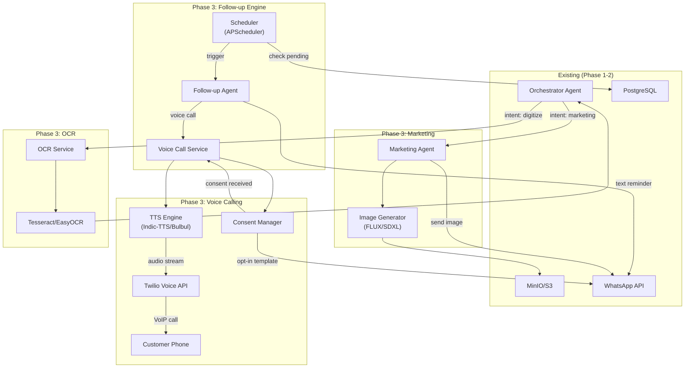
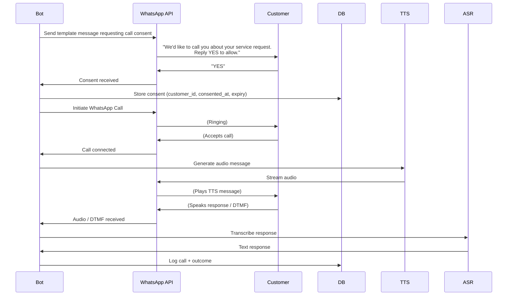

# Phase 3: Follow-ups, Voice Calls & Marketing

> **Scope:** Automated Reminders + WhatsApp Voice Calling (TTS) + Marketing Image Generation + OCR  
> **Duration:** ~3–4 weeks  
> **Goal:** Add proactive intelligence — the system automatically follows up on unanswered quotes/unpaid invoices, makes voice calls via WhatsApp with TTS in local languages, generates marketing visuals using AI image models, and digitizes paper documents via OCR.  
> **Prerequisite:** Phase 2 complete (Orchestrator, Quote/Schedule/Invoice agents operational)

---

## 3.1 Objectives

| # | Objective | Success Metric |
|---|-----------|---------------|
| 1 | Automated follow-up reminders for pending quotes/invoices | Bot sends reminder after configurable delay (e.g., 3 days) |
| 2 | WhatsApp voice calling with TTS | Bot calls customer, plays TTS message in local language |
| 3 | Consent management for outbound calls | Template-based opt-in flow compliant with TRAI/WhatsApp rules |
| 4 | Marketing image generation (AI) | Tradesperson says "make promo for AC repair" → professional image generated |
| 5 | OCR for document digitization | Photo of paper invoice/receipt → structured data extracted |
| 6 | TTS engine for Indic languages | Malayalam, Tamil, Hindi voice synthesis with natural quality |

---

## 3.2 Tech Stack Additions (Phase 3)

| Component | Choice | Rationale |
|-----------|--------|-----------|
| **TTS Engine** | AI4Bharat Indic-TTS / Sarvam Bulbul | Best open-source Indic language coverage (13+ languages) |
| **TTS Fallback** | Coqui TTS (XTTS-v2) | Multi-language, voice cloning capable, open-source |
| **Voice Calling** | Twilio Voice API + WhatsApp Calling | Twilio handles VoIP, IVR, and media streams |
| **Image Generation** | FLUX.1 [schnell] / Stable Diffusion XL | Fast, high-quality, open-source image generation |
| **OCR** | Tesseract OCR + EasyOCR | Indic script support; EasyOCR for better accuracy |
| **Task Scheduler** | APScheduler / Celery Beat | Cron-like scheduler for periodic reminder checks |
| **Consent DB** | PostgreSQL (new tables) | Track call consent status per customer |

---

## 3.3 Architecture (Phase 3 Additions)



---

## 3.4 Detailed Deliverables

### 3.4.1 Automated Follow-up System

**Follow-up Rules Engine:**
```python
# Configurable rules per tradesperson
FOLLOW_UP_RULES = {
    "quote_pending": {
        "delay_days": 3,         # Send first reminder after 3 days
        "max_reminders": 3,      # Maximum 3 reminders
        "interval_days": 2,      # 2 days between reminders
        "escalation": "call",    # After max text reminders, attempt call
        "channels": ["whatsapp_text", "whatsapp_call"],
    },
    "invoice_unpaid": {
        "delay_days": 7,
        "max_reminders": 5,
        "interval_days": 3,
        "escalation": "owner_notify",
        "channels": ["whatsapp_text"],
    },
    "job_reminder": {
        "before_hours": [24, 1],  # Remind 24hrs and 1hr before
        "channels": ["whatsapp_text"],
    },
}
```

**Follow-up Database Schema:**
```sql
CREATE TABLE follow_ups (
    id UUID PRIMARY KEY DEFAULT gen_random_uuid(),
    user_id UUID REFERENCES users(id),
    customer_id UUID REFERENCES customers(id),
    reference_type VARCHAR(20) NOT NULL,    -- 'quote', 'invoice', 'job'
    reference_id UUID NOT NULL,              -- FK to quotes/invoices/jobs
    status VARCHAR(20) DEFAULT 'pending',    -- pending, sent, responded, cancelled
    reminder_count INT DEFAULT 0,
    max_reminders INT DEFAULT 3,
    next_reminder_at TIMESTAMPTZ,
    last_reminded_at TIMESTAMPTZ,
    escalated BOOLEAN DEFAULT FALSE,
    created_at TIMESTAMPTZ DEFAULT NOW(),
    updated_at TIMESTAMPTZ DEFAULT NOW()
);

CREATE INDEX idx_followups_next ON follow_ups(next_reminder_at) WHERE status = 'pending';
```

**Scheduler Service:**
```python
from apscheduler.schedulers.asyncio import AsyncIOScheduler

scheduler = AsyncIOScheduler()

@scheduler.scheduled_job('interval', minutes=15)
async def check_pending_followups():
    """Check for follow-ups due and send reminders."""
    due_followups = await db.query(
        "SELECT * FROM follow_ups WHERE status = 'pending' AND next_reminder_at <= NOW()"
    )
    
    for fu in due_followups:
        if fu.reminder_count >= fu.max_reminders:
            await escalate(fu)  # Notify owner or attempt call
        else:
            await send_reminder(fu)
            await db.update(fu.id, {
                "reminder_count": fu.reminder_count + 1,
                "last_reminded_at": "NOW()",
                "next_reminder_at": f"NOW() + INTERVAL '{rule.interval_days} days'",
            })
```

**Follow-up Agent Prompt:**
```python
FOLLOWUP_AGENT_PROMPT = """
You are a polite follow-up assistant for a {trade_type} business.

Generate a professional, friendly reminder message for a customer.
Tone: warm but clear about action needed.

Context:
- Tradesperson: {user_name} ({trade_type})
- Customer: {customer_name}
- Type: {follow_up_type}  (quote_pending / invoice_unpaid)
- Details: {reference_details}
- Days since sent: {days_elapsed}
- Reminder #: {reminder_count} of {max_reminders}
- Language: {language}

Rules:
- First reminder: gentle, informative
- Second reminder: slightly more direct
- Third reminder: firm but polite, mention deadline
- Never be aggressive or threatening
- Include the amount/quote details
- End with a clear call-to-action

Output: The reminder message text only (no JSON wrapper).
"""
```

**Sample Reminder Messages:**
```
📋 Reminder 1 (Day 3):
"Namaste {Name}! Just checking in about the plumbing quote 
(₹944) we sent on April 21. Would you like to proceed? 
Reply ✅ to confirm or let us know if you have questions! 🙏"

📋 Reminder 2 (Day 5):
"Hi {Name}, friendly reminder about your kitchen sink repair 
quote (₹944). The quote is valid until May 1. 
Shall we schedule the work? 🔧"

📋 Reminder 3 (Day 7):
"Dear {Name}, this is our final reminder regarding quote 
#Q-2026-0042 (₹944) for your kitchen sink repair. 
The quote expires on May 1. Please confirm at your 
earliest convenience. Thank you! 🙏"
```

### 3.4.2 WhatsApp Voice Calling with TTS

**Consent Flow (TRAI + WhatsApp Compliant):**



**Consent Management:**
```sql
CREATE TABLE call_consents (
    id UUID PRIMARY KEY DEFAULT gen_random_uuid(),
    user_id UUID REFERENCES users(id),
    customer_id UUID REFERENCES customers(id),
    customer_phone VARCHAR(15) NOT NULL,
    consent_status VARCHAR(20) DEFAULT 'pending', -- pending, granted, revoked, expired
    consented_at TIMESTAMPTZ,
    expires_at TIMESTAMPTZ,                        -- TRAI requires expiry
    dnd_checked BOOLEAN DEFAULT FALSE,             -- DND registry checked
    dnd_status VARCHAR(10),                        -- 'clear' or 'blocked'
    created_at TIMESTAMPTZ DEFAULT NOW()
);

-- DND check must happen before ANY outbound call/message
-- TRAI TCCCPR 2025 requires:
-- 1. Documented explicit consent
-- 2. Consent has expiry date
-- 3. Number scrubbed against DND registry
```

**TTS Engine Integration:**

```python
# Option A: AI4Bharat Indic-TTS
from indic_tts import TTSEngine

tts = TTSEngine(
    language="ml",  # Malayalam
    speaker="female_1",
    sample_rate=22050,
)

audio_bytes = tts.synthesize(
    "നമസ്കാരം, ഇത് രമേഷ് പ്ലംബിംഗ്. നിങ്ങളുടെ ക്വോട്ടേഷനെ കുറിച്ച് ഓർമ്മിപ്പിക്കാൻ വിളിക്കുന്നു."
)

# Option B: Coqui XTTS-v2 (multi-language with voice cloning)
from TTS.api import TTS

tts = TTS("tts_models/multilingual/multi-dataset/xtts_v2")
tts.tts_to_file(
    text="Hello, this is Ramesh Plumbing. We're calling about your quote.",
    language="hi",
    speaker_wav="ramesh_voice_sample.wav",  # Clone owner's voice!
    file_path="output.wav",
)
```

**Voice Call Service:**
```python
from twilio.rest import Client
from twilio.twiml.voice_response import VoiceResponse

async def make_followup_call(customer_phone: str, tts_audio_url: str):
    """Make a WhatsApp voice call playing TTS audio."""
    # 1. Check consent
    consent = await check_consent(customer_phone)
    if not consent or consent.status != "granted":
        raise ConsentError("No valid consent for this number")
    
    # 2. Check DND
    if not consent.dnd_checked:
        dnd_status = await check_dnd_registry(customer_phone)
        if dnd_status == "blocked":
            raise DndBlockedError("Number is on DND registry")
    
    # 3. Make call
    client = Client(TWILIO_SID, TWILIO_AUTH)
    call = client.calls.create(
        to=f"whatsapp:{customer_phone}",
        from_=f"whatsapp:{TWILIO_NUMBER}",
        url=f"{WEBHOOK_BASE}/api/voice/twiml?audio_url={tts_audio_url}",
    )
    return call.sid

# TwiML endpoint for call script
@router.post("/api/voice/twiml")
async def voice_twiml(audio_url: str):
    response = VoiceResponse()
    response.play(audio_url)
    response.gather(
        input="speech dtmf",
        action=f"{WEBHOOK_BASE}/api/voice/response",
        language="hi-IN",
        timeout=5,
    )
    response.say("Thank you. Goodbye.", language="hi-IN")
    return Response(content=str(response), media_type="text/xml")
```

### 3.4.3 Marketing Image Generation

**Marketing Agent Prompt:**
```python
MARKETING_AGENT_PROMPT = """
You are a marketing assistant for a {trade_type} business.

The tradesperson wants to create a professional marketing image.
Based on their request, generate a detailed image prompt for an AI image model.

Rules:
- Create professional, clean, modern marketing visuals
- Include relevant text overlays (business name, contact, offer)
- Use bright, clear colors suitable for WhatsApp/social media
- Avoid any copyrighted logos or brand imagery
- Make it culturally appropriate for Indian audience

User request: {user_request}
Business name: {business_name}
Contact: {contact_number}

Output a JSON:
{{
  "image_prompt": "detailed prompt for image generation model",
  "overlay_text": ["line 1", "line 2"],
  "style": "professional/vibrant/minimal"
}}
"""
```

**Image Generation Service:**
```python
import torch
from diffusers import FluxPipeline  # or StableDiffusionXLPipeline

class MarketingImageService:
    def __init__(self):
        self.pipe = FluxPipeline.from_pretrained(
            "black-forest-labs/FLUX.1-schnell",
            torch_dtype=torch.float16,
        ).to("cuda")
    
    async def generate(self, prompt: str, output_path: str) -> str:
        image = self.pipe(
            prompt,
            num_inference_steps=4,  # schnell is fast
            guidance_scale=0.0,
            height=1024,
            width=1024,
        ).images[0]
        
        # Add text overlay (business name, contact)
        image = self._add_text_overlay(image, overlay_texts)
        
        image.save(output_path)
        return output_path
    
    def _add_text_overlay(self, image, texts):
        """Add professional text overlay using Pillow."""
        from PIL import ImageDraw, ImageFont
        draw = ImageDraw.Draw(image)
        font = ImageFont.truetype("NotoSans-Bold.ttf", 48)
        # Add text with shadow for readability
        for i, text in enumerate(texts):
            y_pos = image.height - 120 + (i * 60)
            draw.text((50, y_pos), text, fill="white", font=font,
                      stroke_width=2, stroke_fill="black")
        return image
```

**WhatsApp Flow for Marketing:**
```
User: "Make a promo for AC repair summer offer"

Bot: "🎨 Creating your marketing image... (takes ~15 seconds)"

[Bot generates image with FLUX]
[Bot adds text overlay: "Ramesh Electrical - AC Repair ₹999 | Call: +91 98765 43210"]
[Bot uploads to S3]

Bot: [Sends image via WhatsApp]
"Here's your marketing image! 🖼️
You can share this on your WhatsApp Status or send to customers.
Want any changes? (e.g., different colors, text, style)"
```

### 3.4.4 OCR Service

**Purpose:** Digitize paper receipts, invoices, compliance forms via photo.

**OCR Pipeline:**
```python
import easyocr

class OcrService:
    def __init__(self):
        self.reader = easyocr.Reader(
            ['en', 'hi', 'ta', 'ml'],  # Languages
            gpu=True,
        )
    
    async def extract_text(self, image_path: str) -> dict:
        results = self.reader.readtext(image_path)
        
        # Structure results
        extracted = {
            "raw_text": " ".join([r[1] for r in results]),
            "lines": [{"text": r[1], "confidence": r[2], "bbox": r[0]} for r in results],
            "avg_confidence": sum(r[2] for r in results) / len(results) if results else 0,
        }
        
        return extracted
    
    async def extract_invoice_data(self, image_path: str) -> dict:
        """Extract structured data from an invoice image."""
        raw = await self.extract_text(image_path)
        
        # Use LLM to structure the OCR output
        structured = await llm.invoke(
            f"""Extract structured invoice data from this OCR text:
            {raw['raw_text']}
            
            Output JSON with: vendor_name, date, items[], total, tax, grand_total
            """
        )
        return structured
```

---

## 3.5 New File Structure (Additions)

```
app/
├── agents/
│   ├── followup_agent.py       # Follow-up reminder generation
│   └── marketing_agent.py      # Marketing image prompt generation
├── services/
│   ├── tts.py                  # TTS engine (Indic-TTS / Coqui)
│   ├── voice_call.py           # Twilio voice calling
│   ├── consent.py              # Call consent management + DND check
│   ├── image_generator.py      # FLUX/SDXL image generation
│   ├── ocr.py                  # Tesseract/EasyOCR service
│   ├── followup_scheduler.py   # APScheduler for periodic checks
│   └── dnd_registry.py         # TRAI DND registry scrubbing
├── api/
│   ├── voice.py                # Voice call TwiML endpoints
│   ├── followups.py            # Follow-up management routes
│   └── marketing.py            # Marketing image routes
└── models/
    ├── followup.py             # Follow-up Pydantic models
    └── consent.py              # Consent Pydantic models
```

---

## 3.6 TRAI Compliance Checklist

> [!CAUTION]
> Non-compliance with TRAI rules can result in heavy fines and number blacklisting.

| Requirement | Implementation |
|-------------|---------------|
| **Explicit consent** required before outbound calls | Template message + "YES" response stored in DB |
| **Consent expiry** must be documented | `expires_at` field; re-request consent periodically |
| **DND registry scrubbing** before any call | API check against TRAI DND database before calling |
| **Correct number series** (140 for promos, 1600 for service) | Use appropriate Twilio number type |
| **Call timing restrictions** (9 AM – 9 PM) | Scheduler respects time windows per timezone |
| **Opt-out mechanism** | "Reply STOP to opt out" in every message; honor immediately |

---

## 3.7 Acceptance Criteria

| # | Criterion | How to Verify |
|---|-----------|---------------|
| 1 | Follow-up reminder sent after configurable delay | Create quote → wait 3 days → reminder message sent |
| 2 | Reminder escalation works | After 3 text reminders → escalation triggered (call or owner notify) |
| 3 | Quote accepted via reply stops follow-ups | Reply "✅" → follow-up status → "responded" |
| 4 | Consent template sent before call | Attempt call → consent template sent first |
| 5 | Voice call plays TTS in correct language | Accept call → hear TTS message in Malayalam/Hindi |
| 6 | DND check blocks restricted numbers | Test with DND-flagged number → call blocked, logged |
| 7 | Marketing image generated from text request | "Make promo for AC repair" → professional image received |
| 8 | Text overlay on marketing images | Business name + contact visible on image |
| 9 | OCR extracts text from paper invoice | Photo of receipt → structured data returned |
| 10 | All operations logged for audit | Follow-ups, calls, images → entries in DB with timestamps |

---

## 3.8 Testing Strategy

### Unit Tests
- `test_followup_rules.py` — Verify timing, escalation, max reminders
- `test_consent.py` — Consent flow states, expiry, DND check
- `test_tts.py` — TTS generates audio in Hindi, Tamil, Malayalam
- `test_ocr.py` — OCR accuracy on sample receipts (≥ 85%)
- `test_image_gen.py` — Image generation completes, correct dimensions

### Integration Tests
- `test_followup_flow.py` — Quote created → time passes → reminder sent → response stops it
- `test_voice_call_flow.py` — Consent → call → TTS plays → response transcribed
- `test_marketing_flow.py` — WhatsApp request → image generated → sent back

### Compliance Tests
- Verify DND check happens before every outbound communication
- Verify consent records have expiry dates
- Verify opt-out ("STOP") immediately halts all follow-ups
- Verify call timing restrictions (9 AM – 9 PM)

---

## 3.9 Risks & Mitigations

| Risk | Impact | Mitigation |
|------|--------|------------|
| TTS quality poor for some Indic languages | Unnatural voice, bad UX | Benchmark Bulbul vs Indic-TTS vs Coqui; use best per language |
| FLUX/SDXL generates inappropriate images | Brand damage | Content filter on outputs; review first N images manually |
| TRAI DND API unavailable/slow | Can't make calls | Cache DND status for 24hrs; retry with exponential backoff |
| OCR accuracy low on handwritten text | Unusable data | Warn user; offer manual correction flow |
| Too many follow-ups annoy customers | Customer churn | Strict max limits; easy opt-out; owner approval for escalation |
| GPU cost for image generation | High OpEx | Use FLUX.1-schnell (4 steps); queue & batch requests; set daily limits |

---

## 3.10 Phase 3 Exit Criteria

Before moving to Phase 4, ALL of the following must be true:

- [ ] Automated follow-ups trigger correctly based on configurable rules
- [ ] Consent management flow works end-to-end (request → grant → call)
- [ ] TTS generates natural-sounding audio in at least 3 Indic languages
- [ ] Voice calls play correctly via Twilio/WhatsApp
- [ ] DND registry check is enforced before every outbound call
- [ ] Marketing image generation produces professional visuals
- [ ] OCR extracts text from printed documents with ≥ 85% accuracy
- [ ] All follow-up/call/image activities are logged in DB
- [ ] TRAI compliance checklist is fully satisfied
- [ ] At least 25 new unit/integration tests pass
