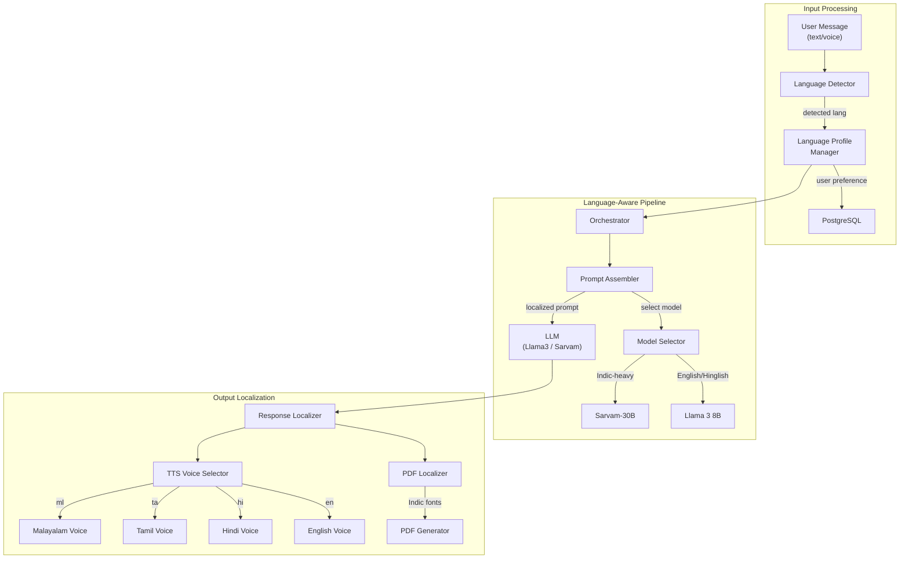
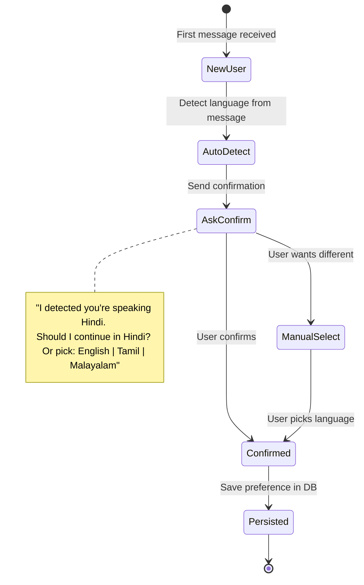

# Phase 4: Localization & Multi-Language Support

> **Scope:** Full Indic Language Support + Code-Mixing + Language Detection + Localized TTS Voices + Translated UI/Prompts  
> **Duration:** ~2–3 weeks  
> **Goal:** Make the entire system truly multilingual — every agent, prompt, TTS voice, and user-facing message works seamlessly in Malayalam, Tamil, Hindi, and English, including code-mixed inputs (Hinglish, Tamlish, Manglish).  
> **Prerequisite:** Phase 3 complete (Follow-ups, Voice Calls, Marketing, OCR all operational)

---

## 4.1 Objectives

| # | Objective | Success Metric |
|---|-----------|---------------|
| 1 | Automatic language detection from user input | ≥ 95% accuracy on 100 test messages (single-language) |
| 2 | Code-mixed input handling (Hinglish, Tamlish, etc.) | Agent responds in matching mix naturally |
| 3 | All agent prompts localized for 4 languages | Quotes, invoices, reminders output in correct language |
| 4 | TTS voices configured per language | Malayalam, Tamil, Hindi, English voices sound natural |
| 5 | User language preference persisted | User sets language once → all future interactions match |
| 6 | PDF documents (quotes/invoices) in local language | Devanagari, Tamil, Malayalam scripts render correctly in PDFs |

---

## 4.2 Supported Languages

| Language | Code | Script | ASR Model | TTS Voice | LLM Support |
|----------|------|--------|-----------|-----------|-------------|
| **English** | `en` | Latin | Whisper ✅ | All engines ✅ | All LLMs ✅ |
| **Hindi** | `hi` | Devanagari | Whisper ✅ | Indic-TTS ✅, Bulbul ✅ | Llama 3 ✅, Sarvam ✅ |
| **Tamil** | `ta` | Tamil | Whisper ✅ | Indic-TTS ✅, Bulbul ✅ | Sarvam ✅, Llama 3 (fair) |
| **Malayalam** | `ml` | Malayalam | Whisper ✅ | Indic-TTS ✅, Bulbul ✅ | Sarvam ✅, Llama 3 (fair) |
| **Kannada** | `kn` | Kannada | Whisper ✅ | Indic-TTS ✅ | Sarvam ✅ (future) |
| **Telugu** | `te` | Telugu | Whisper ✅ | Indic-TTS ✅ | Sarvam ✅ (future) |

> [!NOTE]
> Phase 4 focuses on **Hindi, Tamil, Malayalam, and English**. Kannada and Telugu are listed for future expansion — the architecture supports easy addition.

---

## 4.3 Architecture (Phase 4 Additions)



---

## 4.4 Detailed Deliverables

### 4.4.1 Language Detection Service

**Automatic Detection from Text:**
```python
from langdetect import detect, detect_langs
from lingua import LanguageDetectorBuilder, Language

class LanguageDetector:
    def __init__(self):
        # Lingua is more accurate for Indic languages than langdetect
        self.detector = LanguageDetectorBuilder.from_languages(
            Language.ENGLISH,
            Language.HINDI,
            Language.TAMIL,
            Language.MALAYALAM,
        ).with_minimum_relative_distance(0.25).build()
    
    def detect(self, text: str) -> dict:
        """Detect language of input text."""
        # Primary detection
        detected = self.detector.detect_language_of(text)
        
        # Confidence scores for all languages
        confidences = self.detector.compute_language_confidence_values(text)
        
        # Check for code-mixing
        is_code_mixed = self._detect_code_mixing(text, confidences)
        
        return {
            "primary_language": detected.iso_code_639_1.name.lower() if detected else "en",
            "confidence": confidences[0].value if confidences else 0,
            "is_code_mixed": is_code_mixed,
            "languages_detected": [
                {"lang": c.language.iso_code_639_1.name.lower(), "score": c.value}
                for c in confidences[:3]
            ],
        }
    
    def _detect_code_mixing(self, text: str, confidences: list) -> bool:
        """Detect if text mixes multiple languages (e.g., Hinglish)."""
        if len(confidences) < 2:
            return False
        # If top 2 languages both have > 20% confidence, it's code-mixed
        return confidences[0].value < 0.8 and confidences[1].value > 0.2
```

**Detection from ASR Output:**
- Whisper already detects language during transcription
- Use Whisper's `language` output as a signal
- Cross-reference with text-based detection for higher confidence
- For voice: `detected_language = whisper_result.language or text_detector.detect(transcript)`

**Code-Mixing Examples:**
| Input | Detection | Response Language |
|-------|-----------|------------------|
| "Mera bathroom mein pipe leak ho raha hai" | Hinglish (hi+en) | Hinglish |
| "Kitchen sink repair엔 evvalavu aagum?" | Tamlish (ta+en) | Tamlish |
| "Bathroom-nte pipe leak aanu" | Manglish (ml+en) | Manglish |
| "I need a plumber tomorrow" | English | English |
| "कल सुबह प्लंबर चाहिए" | Hindi | Hindi |

### 4.4.2 Language Profile Manager

**User Language Preference:**
```sql
-- Already exists in users table, but extend:
ALTER TABLE users ADD COLUMN language_auto_detected VARCHAR(10);
ALTER TABLE users ADD COLUMN language_confirmed BOOLEAN DEFAULT FALSE;

-- Customer language tracking
ALTER TABLE customers ADD COLUMN language_auto_detected VARCHAR(10);
ALTER TABLE customers ADD COLUMN language_confirmed BOOLEAN DEFAULT FALSE;
```

**Language Selection Flow:**


**Language Preference API:**
```python
@router.post("/api/users/{user_id}/language")
async def set_language(user_id: str, language: str):
    """Set user's preferred language."""
    valid_langs = ["en", "hi", "ta", "ml"]
    if language not in valid_langs:
        raise HTTPException(400, f"Supported: {valid_langs}")
    
    await db.execute(
        "UPDATE users SET language_preference = $1, language_confirmed = TRUE WHERE id = $2",
        language, user_id,
    )
    return {"status": "ok", "language": language}
```

### 4.4.3 Localized Prompt Templates

**Multi-Language Prompt System:**

All agent prompts from Phase 2-3 need language-aware versions. Instead of duplicating prompts, we use a **language instruction layer:**

```python
LANGUAGE_INSTRUCTIONS = {
    "en": "Respond entirely in English. Use clear, simple language.",
    "hi": "पूरी तरह हिंदी में जवाब दें। सरल और स्पष्ट भाषा का प्रयोग करें। तकनीकी शब्द अंग्रेजी में रख सकते हैं।",
    "ta": "முழுவதும் தமிழில் பதிலளிக்கவும். எளிய மற்றும் தெளிவான மொழியைப் பயன்படுத்தவும்.",
    "ml": "പൂർണ്ണമായും മലയാളത്തിൽ മറുപടി നൽകുക. ലളിതവും വ്യക്തവുമായ ഭാഷ ഉപയോഗിക്കുക.",
    "code_mixed_hi": "Respond in Hinglish (Hindi + English mix). Match the user's style. Technical terms can stay in English.",
    "code_mixed_ta": "Respond in Tanglish (Tamil + English mix). Match the user's style.",
    "code_mixed_ml": "Respond in Manglish (Malayalam + English mix). Match the user's style.",
}

def build_localized_prompt(base_prompt: str, language: str, is_code_mixed: bool) -> str:
    """Inject language instructions into any agent prompt."""
    lang_key = f"code_mixed_{language}" if is_code_mixed else language
    lang_instruction = LANGUAGE_INSTRUCTIONS.get(lang_key, LANGUAGE_INSTRUCTIONS["en"])
    
    return f"""{base_prompt}

LANGUAGE INSTRUCTION:
{lang_instruction}

IMPORTANT: Do NOT translate technical terms that are commonly used in English 
(e.g., GST, plumber, AC, pipe, switch, wire). Keep numbers in Arabic numerals.
Currency should always be shown as ₹.
"""
```

**Localized Quote Example:**

| Language | Quote Output |
|----------|-------------|
| English | "Labor: Kitchen sink repair (2 hrs @ ₹300/hr) = ₹600" |
| Hindi | "मजदूरी: रसोई सिंक मरम्मत (2 घंटे @ ₹300/घंटा) = ₹600" |
| Tamil | "உழைப்பு: சமையலறை சிங்க் பழுது (2 மணி @ ₹300/மணி) = ₹600" |
| Malayalam | "ജോലി: അടുക്കള സിങ്ക് റിപ്പയർ (2 മണിക്കൂർ @ ₹300/മണിക്കൂർ) = ₹600" |

### 4.4.4 Model Selection Strategy

**When to use which LLM:**

```python
class ModelSelector:
    """Select the best LLM based on language and task complexity."""
    
    def select(self, language: str, is_code_mixed: bool, task: str) -> str:
        # Sarvam-30B: best for pure Indic languages
        if language in ["ta", "ml"] and not is_code_mixed:
            return "sarvam-30b"
        
        # Llama 3 8B: good for English, Hinglish, and simple tasks
        if language == "en" or (language == "hi" and task in ["schedule", "general"]):
            return "llama3-8b"
        
        # Llama 3 70B (cloud): complex tasks in any language
        if task in ["quote", "invoice"] and language != "en":
            return "llama3-70b"  # Via Bedrock/cloud
        
        # Default
        return "llama3-8b"
```

> [!IMPORTANT]
> Sarvam-30B requires more GPU memory (~60GB). For local dev, use Llama 3 8B for all languages and switch to Sarvam in production for Tamil/Malayalam tasks.

### 4.4.5 TTS Voice Configuration

```python
TTS_VOICE_CONFIG = {
    "hi": {
        "engine": "indic_tts",
        "speaker": "hindi_female_1",
        "sample_rate": 22050,
        "speed": 1.0,
        "fallback_engine": "coqui_xtts",
    },
    "ta": {
        "engine": "indic_tts",
        "speaker": "tamil_female_1",
        "sample_rate": 22050,
        "speed": 0.95,  # Tamil can be slightly faster
        "fallback_engine": "coqui_xtts",
    },
    "ml": {
        "engine": "indic_tts",
        "speaker": "malayalam_female_1",
        "sample_rate": 22050,
        "speed": 0.95,
        "fallback_engine": "coqui_xtts",
    },
    "en": {
        "engine": "coqui_xtts",
        "speaker": "en_default",
        "sample_rate": 22050,
        "speed": 1.0,
        "fallback_engine": None,
    },
}

async def synthesize_speech(text: str, language: str) -> bytes:
    """Generate speech audio in the correct language."""
    config = TTS_VOICE_CONFIG[language]
    
    try:
        return await tts_engines[config["engine"]].synthesize(
            text=text,
            speaker=config["speaker"],
            sample_rate=config["sample_rate"],
            speed=config["speed"],
        )
    except Exception as e:
        if config["fallback_engine"]:
            return await tts_engines[config["fallback_engine"]].synthesize(
                text=text, language=language
            )
        raise
```

### 4.4.6 PDF Localization (Indic Font Support)

**Problem:** ReportLab/FPDF default fonts don't support Devanagari, Tamil, or Malayalam scripts.

**Solution:** Use Google's Noto fonts which cover all Indic scripts.

```python
from reportlab.pdfbase import pdfmetrics
from reportlab.pdfbase.ttfonts import TTFont

# Register Indic fonts
FONT_MAP = {
    "en": "NotoSans-Regular",
    "hi": "NotoSansDevanagari-Regular",
    "ta": "NotoSansTamil-Regular",
    "ml": "NotoSansMalayalam-Regular",
}

def register_indic_fonts():
    """Register all Indic fonts for PDF generation."""
    for lang, font_name in FONT_MAP.items():
        pdfmetrics.registerFont(TTFont(font_name, f"fonts/{font_name}.ttf"))
        # Also register bold variant
        bold_name = font_name.replace("-Regular", "-Bold")
        pdfmetrics.registerFont(TTFont(bold_name, f"fonts/{bold_name}.ttf"))

def get_font_for_language(language: str) -> str:
    """Get the correct font name for a language."""
    return FONT_MAP.get(language, FONT_MAP["en"])
```

**Download required fonts:**
```bash
# Google Noto Fonts (free, open-source)
mkdir -p fonts/
wget https://github.com/google/fonts/raw/main/ofl/notosans/NotoSans-Regular.ttf -O fonts/
wget https://github.com/google/fonts/raw/main/ofl/notosansdevanagari/NotoSansDevanagari-Regular.ttf -O fonts/
wget https://github.com/google/fonts/raw/main/ofl/notosanstamil/NotoSansTamil-Regular.ttf -O fonts/
wget https://github.com/google/fonts/raw/main/ofl/notosansmalayalam/NotoSansMalayalam-Regular.ttf -O fonts/
```

### 4.4.7 Localized System Messages

```python
SYSTEM_MESSAGES = {
    "welcome": {
        "en": "👋 Welcome! I'm your AI business assistant. How can I help you today?",
        "hi": "👋 नमस्ते! मैं आपका AI बिजनेस असिस्टेंट हूँ। आज मैं आपकी कैसे मदद कर सकता हूँ?",
        "ta": "👋 வணக்கம்! நான் உங்கள் AI வணிக உதவியாளர். இன்று நான் உங்களுக்கு எப்படி உதவ முடியும்?",
        "ml": "👋 നമസ്കാരം! ഞാൻ നിങ്ങളുടെ AI ബിസിനസ് അസിസ്റ്റന്റ് ആണ്. ഇന്ന് ഞാൻ എങ്ങനെ സഹായിക്കാം?",
    },
    "quote_ready": {
        "en": "📋 Your quote is ready!",
        "hi": "📋 आपका कोटेशन तैयार है!",
        "ta": "📋 உங்கள் மேற்கோள் தயார்!",
        "ml": "📋 നിങ്ങളുടെ ക്വോട്ടേഷൻ തയ്യാറാണ്!",
    },
    "job_booked": {
        "en": "✅ Job booked successfully!",
        "hi": "✅ जॉब सफलतापूर्वक बुक हो गई!",
        "ta": "✅ வேலை வெற்றிகரமாக பதிவு செய்யப்பட்டது!",
        "ml": "✅ ജോലി വിജയകരമായി ബുക്ക് ചെയ്തു!",
    },
    "language_select": {
        "en": "🌐 Please select your preferred language:\n1️⃣ English\n2️⃣ हिंदी (Hindi)\n3️⃣ தமிழ் (Tamil)\n4️⃣ മലയാളം (Malayalam)",
    },
    "error_fallback": {
        "en": "Sorry, I didn't understand. Could you rephrase?",
        "hi": "क्षमा करें, मुझे समझ नहीं आया। क्या आप दोबारा बता सकते हैं?",
        "ta": "மன்னிக்கவும், புரியவில்லை. மீண்டும் சொல்ல முடியுமா?",
        "ml": "ക്ഷമിക്കണം, എനിക്ക് മനസ്സിലായില്ല. വീണ്ടും പറയാമോ?",
    },
}

def get_message(key: str, language: str) -> str:
    """Get a localized system message."""
    msgs = SYSTEM_MESSAGES.get(key, {})
    return msgs.get(language, msgs.get("en", ""))
```

---

## 4.5 New File Structure (Additions)

```
app/
├── localization/
│   ├── detector.py            # Language detection service
│   ├── profile.py             # User language profile manager
│   ├── prompts.py             # Localized prompt builder
│   ├── messages.py            # System message translations
│   ├── model_selector.py      # LLM selection by language
│   └── fonts/                 # Noto font files for PDFs
│       ├── NotoSans-Regular.ttf
│       ├── NotoSansDevanagari-Regular.ttf
│       ├── NotoSansTamil-Regular.ttf
│       └── NotoSansMalayalam-Regular.ttf
├── services/
│   └── tts.py                 # Updated with language-specific voice config
└── tests/
    ├── test_language_detection.py
    ├── test_code_mixing.py
    ├── test_localized_prompts.py
    └── test_pdf_indic.py
```

---

## 4.6 ASR Language Improvements

**Enhanced Whisper Configuration:**
```python
# Language-specific ASR tuning
ASR_CONFIG = {
    "hi": {
        "model": "openai/whisper-large-v2",  # Better for Hindi
        "language": "hi",
        "initial_prompt": "यह एक प्लंबिंग और इलेक्ट्रिकल सर्विस कॉल है।",  # Context hint
    },
    "ta": {
        "model": "openai/whisper-large-v2",
        "language": "ta",
        "initial_prompt": "இது ஒரு பிளம்பிங் மற்றும் எலக்ட்ரிக்கல் சேவை அழைப்பு.",
    },
    "ml": {
        "model": "openai/whisper-large-v2",
        "language": "ml",
        "initial_prompt": "ഇത് ഒരു പ്ലംബിംഗ്, ഇലക്ട്രിക്കൽ സർവീസ് കോൾ ആണ്.",
    },
    "en": {
        "model": "openai/whisper-medium",  # Medium sufficient for English
        "language": "en",
        "initial_prompt": "This is a plumbing and electrical service call.",
    },
}
```

**IndicWav2Vec as Fallback:**
```python
# For languages where Whisper struggles, use AI4Bharat's IndicWav2Vec
from indicnlp.transliterate import unicode_transliterate

class IndicASR:
    """Fallback ASR using AI4Bharat's IndicWav2Vec for better Indic accuracy."""
    
    def __init__(self, language: str):
        self.model = load_indicwav2vec(language)
    
    async def transcribe(self, audio_path: str) -> str:
        # IndicWav2Vec outputs in native script
        result = self.model.transcribe(audio_path)
        return result["text"]
```

---

## 4.7 Acceptance Criteria

| # | Criterion | How to Verify |
|---|-----------|---------------|
| 1 | Language auto-detected from text | 100 test messages → ≥ 95% correct detection |
| 2 | Code-mixing detected | 20 Hinglish/Tamlish messages → all flagged as code-mixed |
| 3 | Agent responds in user's language | Hindi input → Hindi response; Tamil → Tamil |
| 4 | Code-mixed response matches input style | Hinglish input → Hinglish response (not pure Hindi or English) |
| 5 | Language preference persisted | Set language → next conversation uses same language |
| 6 | Language selection menu works | New user → menu displayed → selection saved |
| 7 | Quote in local language | Request quote in Tamil → itemized quote in Tamil |
| 8 | Invoice PDF renders Indic scripts | Hindi invoice → Devanagari text renders correctly in PDF |
| 9 | TTS in correct language | Malayalam TTS → natural-sounding Malayalam audio |
| 10 | ASR accuracy per language | Hindi ≥ 85%, Tamil ≥ 80%, Malayalam ≥ 80% WER |

---

## 4.8 Testing Strategy

### Language Detection Tests (`test_language_detection.py`)
```python
TEST_CASES = [
    ("I need a plumber", "en", False),
    ("मुझे प्लंबर चाहिए", "hi", False),
    ("எனக்கு ப்ளம்பர் வேண்டும்", "ta", False),
    ("എനിക്ക് ഒരു പ്ലംബർ വേണം", "ml", False),
    ("Mujhe plumber chahiye kal subah", "hi", True),   # Hinglish
    ("Enakku plumber venum tomorrow morning", "ta", True),  # Tamlish
    ("Enikku oru plumber venam morning", "ml", True),  # Manglish
]
```

### Multi-Language Agent Tests
- Run all 50 orchestrator test messages in each language
- Verify quote generation in all 4 languages
- Verify invoice PDF renders correctly in all scripts
- Test voice call TTS in all 4 languages

### Edge Case Tests
- Mixed script input (e.g., English + Devanagari in same message)
- Very short messages (1–2 words) — harder to detect language
- Emoji-heavy messages
- Numbers and currency (₹) mixed with Indic text

---

## 4.9 Risks & Mitigations

| Risk | Impact | Mitigation |
|------|--------|------------|
| Llama 3 8B poor at Tamil/Malayalam | Bad quality responses | Use Sarvam-30B for pure Indic; benchmark both |
| Language detection fails on short text | Wrong language reply | Require minimum 3 words; fallback to user's saved preference |
| Code-mixing confuses LLM | Inconsistent responses | Explicit prompt instructions; few-shot examples of code-mixed I/O |
| Indic fonts missing glyphs | Broken PDF characters | Test all Unicode ranges; use Noto fonts (comprehensive coverage) |
| TTS pronunciation errors | Unnatural voice | Quality test each language with native speakers; tune speed/pitch |

---

## 4.10 Phase 4 Exit Criteria

Before moving to Phase 5, ALL of the following must be true:

- [ ] Language detection works for all 4 languages + code-mixing
- [ ] All agents produce correct output in all supported languages
- [ ] User language preference is saved and respected
- [ ] PDF invoices/quotes render correctly in Devanagari, Tamil, Malayalam scripts
- [ ] TTS generates natural audio in all 4 languages
- [ ] ASR achieves target WER for each language
- [ ] Code-mixed inputs handled gracefully
- [ ] Language selection onboarding flow works for new users
- [ ] At least 20 new language-specific tests pass
- [ ] Native speaker review completed for each language (quality check)
