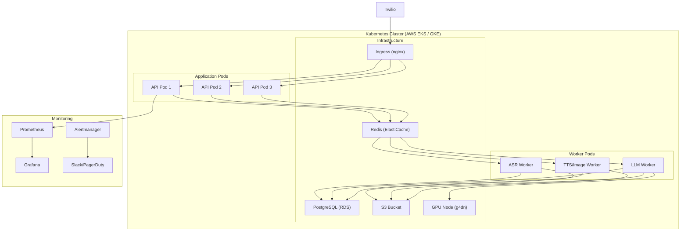

# Phase 5: Testing, Scaling & Production Rollout

> **Scope:** Integration Testing + Load Testing + Security/Compliance Audit + Docker/K8s Deployment + Monitoring + Rollout  
> **Duration:** ~3–4 weeks  
> **Goal:** Harden the entire system for production — comprehensive testing, containerized deployment, observability, DPDP/TRAI compliance audit, and phased rollout to real tradespeople.  
> **Prerequisite:** Phases 1–4 complete

---

## 5.1 Objectives

| # | Objective | Success Metric |
|---|-----------|---------------|
| 1 | End-to-end integration tests pass | All 8 core flows tested and green |
| 2 | Load testing proves scalability | Handle 1000 concurrent users, <2s p95 latency |
| 3 | Security & compliance audit passed | DPDP Act, TRAI, WhatsApp policy compliant |
| 4 | Kubernetes deployment operational | 3-replica deployment with auto-scaling |
| 5 | Monitoring & alerting live | Grafana dashboards, PagerDuty/Slack alerts |
| 6 | Pilot rollout with real users | 10–20 tradespeople onboarded, feedback collected |

---

## 5.2 Testing Strategy

### 5.2.1 End-to-End Test Flows

| # | Flow | Steps | Expected |
|---|------|-------|----------|
| 1 | Text scheduling | Send "need plumber Friday 9AM" → confirm → verify DB | Job created, confirmation sent |
| 2 | Voice quoting | Send Hindi voice note about leak → receive itemized quote | ASR → Quote Agent → formatted reply |
| 3 | Invoice generation | Mark job complete → generate invoice → send PDF | PDF with GST, sent via WhatsApp |
| 4 | Follow-up reminder | Create quote → wait trigger → reminder sent | Auto-reminder after configured delay |
| 5 | Voice call | Grant consent → bot calls → TTS plays | Voice message heard on phone |
| 6 | Marketing image | Request "promo for AC repair" → image generated | Professional image sent back |
| 7 | OCR digitization | Send photo of receipt → structured data returned | Extracted text with >85% accuracy |
| 8 | Multi-language | Send Tamil message → Tamil response | Correct language detection & reply |

### 5.2.2 Load Testing (Locust/k6)

```python
# locustfile.py
from locust import HttpUser, task, between

class TradesBotUser(HttpUser):
    wait_time = between(1, 3)
    
    @task(5)
    def send_text_message(self):
        self.client.post("/api/webhooks/twilio", data={
            "From": f"whatsapp:+9198765{self.environment.runner.user_count:05d}",
            "Body": "I need a plumber tomorrow morning",
            "MessageSid": f"SM{uuid4().hex[:32]}",
        })
    
    @task(2)
    def generate_quote(self):
        self.client.post("/api/quotes", json={
            "user_id": "test-user", "description": "Fix bathroom leak"
        })
    
    @task(1)
    def generate_invoice(self):
        self.client.post("/api/invoices", json={
            "job_id": "test-job", "user_id": "test-user"
        })
```

**Targets:** 1000 concurrent users, p95 < 2s (text), p95 < 10s (voice/image), 0% error rate.

### 5.2.3 Security Audit Checklist

| Area | Check | Status |
|------|-------|--------|
| API auth | Twilio signature validation on all webhooks | ☐ |
| Data encryption | TLS in transit, AES-256 at rest (DB + S3) | ☐ |
| PII handling | Customer data anonymized in logs, consent-gated | ☐ |
| DPDP Act 2023 | Data hosted in India, retention policies, deletion API | ☐ |
| TRAI compliance | DND scrubbing, consent records, call timing | ☐ |
| WhatsApp policy | Verified business profile, approved templates | ☐ |
| Secrets management | All keys in env/vault, no hardcoded secrets | ☐ |
| Input sanitization | SQL injection, XSS, prompt injection mitigated | ☐ |

---

## 5.3 Deployment Architecture



### Kubernetes Manifests (Key Snippets)

```yaml
# deployment.yaml (API)
apiVersion: apps/v1
kind: Deployment
metadata:
  name: tradesbot-api
spec:
  replicas: 3
  selector:
    matchLabels:
      app: tradesbot-api
  template:
    spec:
      containers:
      - name: api
        image: tradesbot/api:latest
        ports:
        - containerPort: 8000
        envFrom:
        - secretRef:
            name: tradesbot-secrets
        resources:
          requests: { cpu: "500m", memory: "512Mi" }
          limits: { cpu: "1000m", memory: "1Gi" }
        readinessProbe:
          httpGet: { path: /health, port: 8000 }
---
# HPA for auto-scaling
apiVersion: autoscaling/v2
kind: HorizontalPodAutoscaler
metadata:
  name: tradesbot-api-hpa
spec:
  scaleTargetRef:
    apiVersion: apps/v1
    kind: Deployment
    name: tradesbot-api
  minReplicas: 3
  maxReplicas: 20
  metrics:
  - type: Resource
    resource:
      name: cpu
      target: { type: Utilization, averageUtilization: 70 }
```

---

## 5.4 Monitoring & Observability

**Grafana Dashboards:**
- **System:** CPU, memory, pod count, request rate, error rate
- **Business:** Messages/day, quotes generated, invoices sent, calls made
- **AI:** ASR accuracy, LLM latency, TTS generation time, image gen time
- **Compliance:** Consent rates, DND blocks, opt-outs

**Alerts:**
| Alert | Condition | Channel |
|-------|-----------|---------|
| High error rate | >5% 5xx in 5 min | PagerDuty |
| LLM latency spike | p95 > 10s for 5 min | Slack |
| ASR failures | >10% failures in 1 hr | Slack |
| Queue backlog | >100 pending jobs | Slack |
| DB connection pool exhausted | <2 free connections | PagerDuty |

---

## 5.5 Rollout Plan

| Stage | Users | Duration | Focus |
|-------|-------|----------|-------|
| **Alpha** | 5 internal testers | 1 week | Bug finding, flow validation |
| **Beta** | 10–20 real tradespeople (Kerala/TN) | 2 weeks | Usability, language quality, feedback |
| **Soft Launch** | 100 tradespeople (word of mouth) | 4 weeks | Scalability, reliability |
| **GA** | Open registration | Ongoing | Growth, feature iteration |

**Onboarding Materials:**
- WhatsApp Business number (verified, branded)
- 2-minute voice note tutorial in Hindi/Malayalam/Tamil
- Quick-start message: "Send 'Hi' to get started"
- Printed QR code cards for distribution

---

## 5.6 Acceptance Criteria

| # | Criterion | How to Verify |
|---|-----------|---------------|
| 1 | All 8 E2E test flows pass | Automated test suite green |
| 2 | Load test: 1000 users, <2s p95 | Locust/k6 report |
| 3 | Security audit passed | Checklist signed off |
| 4 | K8s deployment healthy | 3 replicas running, HPA functional |
| 5 | Monitoring dashboards live | Grafana accessible, data flowing |
| 6 | Alerts firing correctly | Test alert → notification received |
| 7 | DPDP compliance verified | Data residency, consent, deletion tested |
| 8 | Beta users actively using system | ≥10 users with ≥5 interactions each |

---

## 5.7 Phase 5 Exit Criteria (Production Ready)

- [ ] All automated tests pass (unit + integration + E2E)
- [ ] Load test targets met
- [ ] Security/compliance audit signed off
- [ ] Kubernetes deployment stable for 72+ hours
- [ ] Monitoring and alerting verified
- [ ] Beta feedback incorporated
- [ ] Runbook and incident response documented
- [ ] WhatsApp Business profile verified by Meta
- [ ] Production API keys and secrets in vault
- [ ] DNS, SSL, and domain configured
